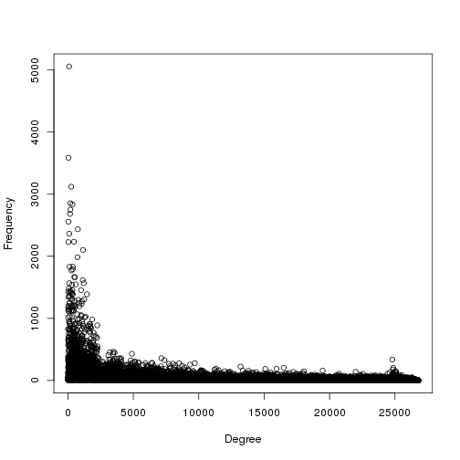
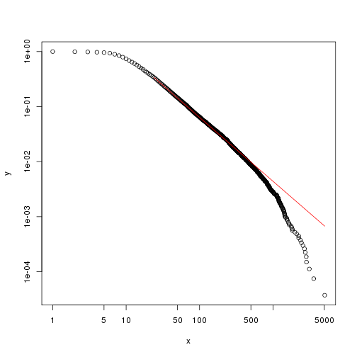
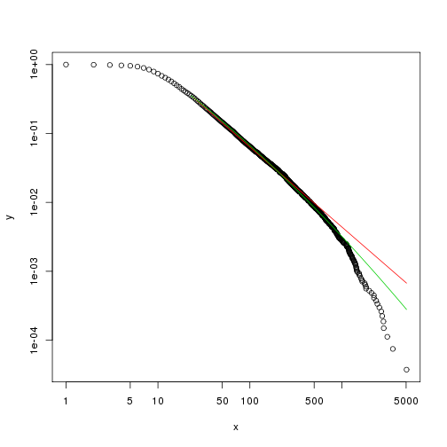
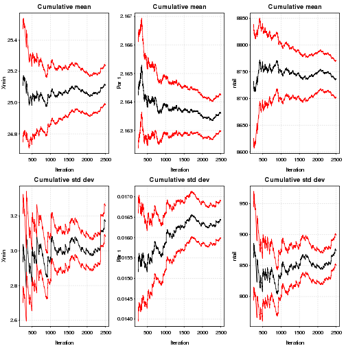
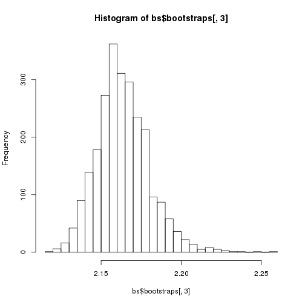
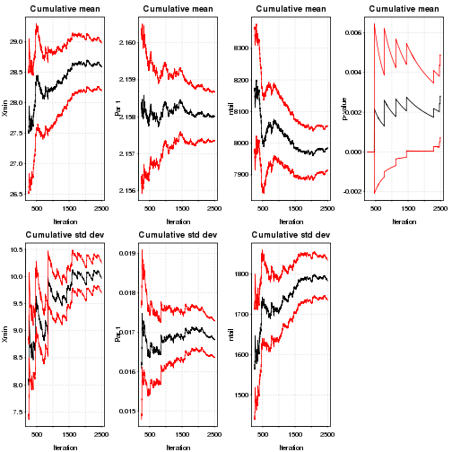

<h3>Μία πρώτη αναπαράσταση των δεδομένων (σε log-log plot)</h3>

Όπως γνωρίζουμε μία υποψήφια power law θα πρέπει να παρουσιάζει μία σχεδόν γραμμική σχέση σε ένα log-log plot εκτεινόμενη τουλάχιστον σε 2 τάξεις μεγέθους (τόσο στον άξονα των x, όσο και των y).
Ωστόσο, αυτό αποτελεί μία αναγκαία, αλλα όχι ικανή συνθήκη, που όμως έχει εσφαλμένα χρησιμοποιηθεί στο παρελθόν σε πολλές επιστημονικές εργασίες. <i>[Michael P. H. Stumpf  and Mason A. Porter, Critical Truths About Power Laws, Science, 2012, vol. 335, 665-666]</i> </br>


```
## Parsed with column specification:
## cols(
##   partner1 = col_character(),
##   partner2 = col_character(),
##   weight = col_integer()
## )
```



Θα εξετάσουμε αν η κατανομή των δεδομένων ακολουθεί την power law σύμφωνα με τον αλγόριθμο που προτάθηκε από τους Clauset, Shalizi και Newman <i>[Aaron Clauset, Cosma Rohilla Shalizi, and M.E.J. Newman, 2009, Power-Law Distributions in Empirical Data, SIAM Review 51, 661-703]</i>.</br></br>

Για το σκοπό αυτό θα χρησιμοποιήσουμε το πακέτο "poweRlaw" της γλώσσας προγραμματισμού R. <i>[Colin Gillespie, 2016, "poweRlaw: Analysis of Heavy Tailed Distributions"]</i>

<h3>Εκτίμηση των παραμέτρων $x_{min}$ και $α$</h3>


```r
est_pl<-estimate_xmin(pl_m)
est_pl$xmin
```

```
## [1] 24
```


```r
pl_m$setXmin(est_pl)
pl_m$getPars()
```

```
## [1] 2.157868
```

<h3>Η κατανομή των δεδομένων και το εκτιμώμενο μοντέλο</h3>

Η κόκκινη γραμμή απεικονίζει την εκτιμώμενη power law για την κατανομή.


```r
plot(pl_m);
lines(pl_m, col=2)
```




Για την προσαρμογή άλλων μοντέλων, ακολουθούμε την ίδια διαδικασία. Παρακάτω απεικονίζεται η προσαρμογή της power law και της log-normal στα δεδομένα μας.
Η πράσινη γραμμή απεικονίζει την εκτιμώμενη lognormal για την κατανομή</br>
Η κόκκινη γραμμή απεικονίζει την εκτιμώμενη power law για την κατανομή.</br>


```r
plot(ln_m)
lines(pl_m, col=2) 
lines(ln_m, col=3)
```



<h3>Bootstrap </h3>
Για να βρούμε τα περιθώρια λάθους στις εκτιμώμενες παραμέτρους χρησιμοποιούμε την μέθοδο bootstrap, η οποία ακολουθεί τον εξής αλγόριθμο:</br>

***
<i>Uncertainty in xmin</i>
***

    1:Set N equal to the number of values in the original data set
    2: for i in 1:B:
    3:  Sample N values from the original data set
    4:  Estimate xmin and α
    5:end for
    
***
</br>

Εάν θέλουμε το p-value να έχει ακρίβεια ε από την πραγματική τιμή, τότε πρέπει να παράξουμε τουλάχιστον $ \frac{1}{4} * ε^{-2} $ δείγματα. Δηλαδή για ακρίβεια 2 δεκαδικών ψηφίων για το p-value, έχουμε ε=0.01 και επομένως χρειαζόμαστε 2500 data sets.</br></br>

 Η μέθοδος bootstrap επιστρέφει 3 αποτελέσματα.

    1. **gof**
    Το στατιστικό από το Kolmogorov-Smirnov test (goodness-of-fit). Η τιμή αυτή  αντιστοιχεί στα αποτελέσματα της συνάρτησης estimate_xmin.
    2. **bootstraps**
    Aποτελεί ένα dataframe που περιέχει τα αποτελέσματα της μεθόδου.
    3. **sim_time**
    Ο μέσος χρόνος της προσομοίωσης για κάθε επανάληψη (σε sec.)

</br></br>

Παρακάτω εμφανίζουμε τα αποτελέσματα της μεθόδου για 10 από τις 2500 επαναλήψεις:


```r
num_threads<-strtoi(system("cat $PBS_NODEFILE| wc -l", intern = TRUE))
bs<-bootstrap(pl_m, no_of_sims=2500, threads=num_threads, seed=1)
```

```
## Expected total run time for 2500 sims, using 32 threads is 1420 seconds.
```

```r
bs$bootstraps[1:10,]
```

```
##           gof xmin     pars ntail
## 1  0.01455183   25 2.177097  8733
## 2  0.01062422   25 2.169630  8787
## 3  0.01133240   23 2.155392  9442
## 4  0.01331894   25 2.168504  8610
## 5  0.01058813   24 2.167100  9117
## 6  0.01022844   25 2.177086  8638
## 7  0.01026151   24 2.176332  9055
## 8  0.01400583   24 2.147820  9052
## 9  0.01259452   24 2.165670  9050
## 10 0.01512146   35 2.183429  5872
```

```r
bs
```

```
## $gof
## [1] 0.01085476
## 
## $bootstraps
##              gof xmin     pars ntail
## 1    0.014551833   25 2.177097  8733
## 2    0.010624223   25 2.169630  8787
## 3    0.011332397   23 2.155392  9442
## 4    0.013318937   25 2.168504  8610
## 5    0.010588132   24 2.167100  9117
## 6    0.010228444   25 2.177086  8638
## 7    0.010261510   24 2.176332  9055
## 8    0.014005826   24 2.147820  9052
## 9    0.012594517   24 2.165670  9050
## 10   0.015121462   35 2.183429  5872
## 11   0.014011555   23 2.135002  9527
## 12   0.012202051   25 2.152686  8775
## 13   0.014190667   23 2.151756  9445
## 14   0.014077044   25 2.172155  8604
## 15   0.012169105   24 2.161793  9107
## 16   0.011650855   24 2.187106  9096
## 17   0.010641337   23 2.152283  9442
## 18   0.009374445   24 2.178540  9027
## 19   0.013033115   24 2.163614  9019
## 20   0.012701045   23 2.150995  9510
## 21   0.010310333   25 2.176111  8758
## 22   0.012494605   24 2.162948  8989
## 23   0.009748641   24 2.147368  9142
## 24   0.016906436   31 2.185022  6807
## 25   0.009342497   25 2.179165  8792
## 26   0.011009229   25 2.165177  8715
## 27   0.011818143   23 2.158866  9532
## 28   0.009056895   25 2.185707  8571
## 29   0.009502836   23 2.161037  9517
## 30   0.012915473   23 2.141204  9571
## 31   0.014389876   24 2.156506  9053
## 32   0.014961551   25 2.174715  8816
## 33   0.012577154   24 2.156868  9042
## 34   0.010249450   25 2.184065  8852
## 35   0.014302877   24 2.150001  8969
## 36   0.011726392   23 2.138890  9468
## 37   0.011958011   25 2.157191  8637
## 38   0.009860102   23 2.146130  9338
## 39   0.015310767   25 2.185968  8612
## 40   0.012612727   24 2.166506  9211
## 41   0.013931323   25 2.170573  8825
## 42   0.009240551   24 2.167661  9014
## 43   0.013242262   24 2.145973  8944
## 44   0.011949091   24 2.156766  9042
## 45   0.013117375   25 2.178701  8776
## 46   0.013900109   24 2.174476  8928
## 47   0.014627835   23 2.162348  9462
## 48   0.011173297   25 2.148554  8830
## 49   0.013638700   24 2.155134  9129
## 50   0.010311543   25 2.166401  8729
## 51   0.013691946   23 2.149706  9405
## 52   0.014283209   23 2.152939  9416
## 53   0.014429192   22 2.143097  9959
## 54   0.012344717   23 2.139513  9398
## 55   0.012996129   25 2.151107  8854
## 56   0.010180907   23 2.147951  9298
## 57   0.012553530   23 2.148377  9403
## 58   0.009624720   24 2.158993  9043
## 59   0.012781807   25 2.154671  8824
## 60   0.013807064   25 2.155049  8704
## 61   0.013814365   25 2.185956  8643
## 62   0.011648583   25 2.170534  8617
## 63   0.014189580   25 2.155906  8887
## 64   0.013938926   25 2.175293  8753
## 65   0.010172631   23 2.147808  9502
## 66   0.010040538   23 2.155226  9429
## 67   0.010603580   24 2.158301  9169
## 68   0.015448465   25 2.178594  8743
## 69   0.011889972   24 2.159493  9062
## 70   0.013793833   23 2.138486  9407
## 71   0.008591909   25 2.166135  8748
## 72   0.016023864   24 2.157199  9013
## 73   0.012553359   25 2.139350  8705
## 74   0.010903645   23 2.164215  9683
## 75   0.009777115   25 2.170406  8674
## 76   0.009276690   24 2.157411  9055
## 77   0.011264419   23 2.159177  9353
## 78   0.014887237   23 2.143638  9478
## 79   0.007711689   25 2.168164  8752
## 80   0.015657460   22 2.134877  9701
## 81   0.011257387   24 2.144104  9027
## 82   0.011554611   25 2.160519  8694
## 83   0.013520628   35 2.205735  5998
## 84   0.013823879   25 2.178675  8773
## 85   0.011981894   25 2.195509  8680
## 86   0.014405460   25 2.161617  8709
## 87   0.011396215   25 2.178191  8777
## 88   0.014368055   25 2.153898  8679
## 89   0.011634236   24 2.165216  9133
## 90   0.011555399   23 2.147838  9468
## 91   0.013890345   25 2.179355  8628
## 92   0.013953354   24 2.143587  8955
## 93   0.012225200   31 2.167308  6939
## 94   0.013701523   25 2.157777  8701
## 95   0.012330665   35 2.178509  5921
## 96   0.012241633   28 2.191683  7590
## 97   0.013630042   25 2.168022  8719
## 98   0.011466801   27 2.174814  8036
## 99   0.012780194   32 2.162743  6620
## 100  0.014185568   38 2.192191  5453
## 101  0.013507842   25 2.164394  8676
## 102  0.009323003   25 2.160930  8753
## 103  0.011208247   24 2.171719  9134
## 104  0.015567243   25 2.160206  8668
## 105  0.012908582   32 2.169295  6589
## 106  0.014115289   28 2.188500  7692
## 107  0.014064350   23 2.132348  9333
## 108  0.012811040   25 2.162021  8732
## 109  0.013305559   23 2.148368  9439
## 110  0.013546176   24 2.158308  8911
## 111  0.009890638   25 2.145296  8715
## 112  0.010752676   24 2.154721  8975
## 113  0.009047677   24 2.168500  9125
## 114  0.012094318   24 2.156022  9091
## 115  0.010336052   24 2.147752  9069
## 116  0.010017115   25 2.177672  8621
## 117  0.010432114   25 2.167397  8617
## 118  0.009524786   25 2.201393  8651
## 119  0.013563120   23 2.163597  9489
## 120  0.012693915   23 2.157477  9427
## 121  0.018153888   25 2.173807  8807
## 122  0.013907477   23 2.145988  9515
## 123  0.011318012   28 2.178333  7562
## 124  0.011979019   25 2.174982  8569
## 125  0.009133571   24 2.158643  9029
## 126  0.011053990   24 2.138036  9078
## 127  0.012835882   24 2.158861  9077
## 128  0.011418424   28 2.173028  7642
## 129  0.010534450   25 2.169288  8691
## 130  0.012264259   24 2.156027  9065
## 131  0.013846111   24 2.153106  9077
## 132  0.010708232   38 2.205192  5317
## 133  0.013024006   25 2.175720  8754
## 134  0.012410648   24 2.180027  9072
## 135  0.012209890   25 2.158466  8767
## 136  0.013027299   25 2.175476  8885
## 137  0.013109304   32 2.164697  6597
## 138  0.012840276   24 2.169522  9093
## 139  0.011344984   23 2.133390  9513
## 140  0.011198447   24 2.166403  8879
## 141  0.009739509   25 2.183599  8761
## 142  0.012422918   23 2.166165  9433
## 143  0.012693716   25 2.161610  8528
## 144  0.011604066   24 2.161702  9109
## 145  0.011294069   25 2.175333  8801
## 146  0.013178521   23 2.154505  9412
## 147  0.009243128   25 2.166014  8676
## 148  0.011492881   24 2.157830  8904
## 149  0.012993407   25 2.158825  8655
## 150  0.011589596   25 2.141213  8835
## 151  0.007847211   25 2.194593  8752
## 152  0.014641026   23 2.146936  9458
## 153  0.012248646   32 2.175815  6576
## 154  0.013983855   23 2.147424  9386
## 155  0.009366545   25 2.164349  8702
## 156  0.010408141   24 2.176447  9090
## 157  0.014501171   25 2.144187  8747
## 158  0.014380503   24 2.173753  9076
## 159  0.011803680   32 2.172238  6657
## 160  0.011384009   24 2.163977  8923
## 161  0.013274567   23 2.149401  9307
## 162  0.012351084   25 2.164536  8709
## 163  0.011576318   23 2.161313  9439
## 164  0.008282581   25 2.171636  8767
## 165  0.014696941   35 2.190118  5974
## 166  0.009329470   24 2.171617  9140
## 167  0.009757280   24 2.176836  9032
## 168  0.014765374   25 2.171565  8678
## 169  0.014972050   25 2.172219  8528
## 170  0.009050717   23 2.152931  9379
## 171  0.010392317   25 2.169934  8567
## 172  0.010102798   23 2.162151  9403
## 173  0.011644284   24 2.164438  9028
## 174  0.010712751   24 2.143800  9101
## 175  0.011807620   24 2.167217  9057
## 176  0.014604859   25 2.164012  8591
## 177  0.012372158   37 2.216722  5619
## 178  0.012722859   25 2.178186  8651
## 179  0.013445069   25 2.159554  8704
## 180  0.010146543   25 2.167561  8780
## 181  0.014206212   25 2.175550  8894
## 182  0.012416011   23 2.152737  9474
## 183  0.008742128   25 2.161577  8649
## 184  0.014140648   32 2.163931  6587
## 185  0.011469888   25 2.188275  8689
## 186  0.011330046   28 2.181208  7753
## 187  0.010019577   24 2.166151  9046
## 188  0.011445017   22 2.138987  9933
## 189  0.014803280   38 2.191667  5511
## 190  0.017568159   28 2.167936  7719
## 191  0.012653540   24 2.166990  8998
## 192  0.011861389   25 2.172703  8781
## 193  0.009175747   25 2.161700  8685
## 194  0.011259570   25 2.179251  8683
## 195  0.014413608   22 2.141863  9820
## 196  0.015457816   23 2.139269  9392
## 197  0.016136214   25 2.166031  8886
## 198  0.010068845   24 2.157949  9142
## 199  0.014029314   24 2.187425  8973
## 200  0.015330010   32 2.188325  6550
## 201  0.010723101   24 2.161230  9010
## 202  0.012941588   31 2.194386  6757
## 203  0.010074711   24 2.167999  9015
## 204  0.013837934   35 2.209900  5929
## 205  0.010180947   25 2.187959  8605
## 206  0.010557852   25 2.160948  8692
## 207  0.010820364   24 2.167477  9123
## 208  0.011407496   24 2.154179  9090
## 209  0.013355683   23 2.150072  9494
## 210  0.009178144   23 2.159487  9456
## 211  0.015205274   25 2.163409  8778
## 212  0.008817340   25 2.160859  8626
## 213  0.013895263   25 2.167169  8637
## 214  0.015962583   38 2.198091  5397
## 215  0.008703421   25 2.164103  8653
## 216  0.013518509   23 2.127361  9565
## 217  0.013868661   24 2.158927  9061
## 218  0.010922523   28 2.157228  7477
## 219  0.010681648   25 2.174215  8799
## 220  0.010161740   25 2.158619  8871
## 221  0.010998487   24 2.161385  9136
## 222  0.009790414   24 2.168685  9182
## 223  0.013617342   25 2.164811  8723
## 224  0.013215682   24 2.169030  9000
## 225  0.013285246   23 2.156992  9349
## 226  0.012912690   23 2.124430  9555
## 227  0.011243317   23 2.150101  9424
## 228  0.012105094   25 2.182243  8696
## 229  0.013549382   23 2.147279  9375
## 230  0.010818907   25 2.166961  8560
## 231  0.014407385   25 2.174622  8657
## 232  0.013973984   23 2.152443  9494
## 233  0.014281797   25 2.171838  8771
## 234  0.009846095   32 2.187880  6463
## 235  0.012661709   25 2.161605  8628
## 236  0.013599785   25 2.169899  8817
## 237  0.011187211   25 2.156903  8692
## 238  0.013028383   23 2.140310  9506
## 239  0.010989918   25 2.175987  8715
## 240  0.009190439   25 2.162007  8785
## 241  0.009979177   25 2.174557  8641
## 242  0.011423961   25 2.173794  8615
## 243  0.009017444   25 2.168621  8659
## 244  0.010664511   24 2.150360  8970
## 245  0.011273975   23 2.141845  9319
## 246  0.009470532   25 2.190435  8695
## 247  0.014273508   25 2.169430  8795
## 248  0.013679385   23 2.152745  9529
## 249  0.012674812   23 2.156061  9490
## 250  0.012925195   24 2.152156  9058
## 251  0.011171309   25 2.148593  8806
## 252  0.014508897   25 2.157582  8895
## 253  0.011644579   25 2.184214  8784
## 254  0.010494138   23 2.152114  9447
## 255  0.009285162   23 2.158835  9474
## 256  0.008688515   25 2.154648  8573
## 257  0.014886709   38 2.218708  5394
## 258  0.008979691   25 2.185131  8715
## 259  0.012077129   25 2.160404  8778
## 260  0.012479557   25 2.155587  8934
## 261  0.012204289   25 2.176667  8692
## 262  0.011088400   24 2.153832  9091
## 263  0.010117587   24 2.174646  9038
## 264  0.014358950   25 2.159942  8646
## 265  0.011302963   32 2.197350  6561
## 266  0.011541288   24 2.144016  9145
## 267  0.013514679   23 2.159505  9369
## 268  0.009954722   25 2.152195  8777
## 269  0.010312938   25 2.185121  8639
## 270  0.012915156   24 2.137576  9050
## 271  0.012350818   25 2.159976  8746
## 272  0.015139701   24 2.167148  8927
## 273  0.011642823   24 2.157613  9174
## 274  0.009640655   25 2.176411  8737
## 275  0.012838361   32 2.200825  6506
## 276  0.010744476   24 2.166551  9091
## 277  0.009221627   24 2.177010  9008
## 278  0.010160125   25 2.177426  8692
## 279  0.013945116   25 2.149183  8585
## 280  0.011427985   24 2.152173  8897
## 281  0.015095666   23 2.155521  9330
## 282  0.014036018   25 2.182045  8613
## 283  0.011199886   25 2.160284  8584
## 284  0.010677504   23 2.171192  9501
## 285  0.014864740   25 2.177179  8597
## 286  0.010538256   24 2.155654  9006
## 287  0.017767920   32 2.185679  6685
## 288  0.013441978   23 2.148064  9594
## 289  0.011146921   24 2.136963  9170
## 290  0.012235770   24 2.156097  9059
## 291  0.013586005   25 2.171701  8670
## 292  0.013036400   24 2.171376  9013
## 293  0.010976020   25 2.191101  8713
## 294  0.011902093   32 2.169866  6626
## 295  0.009239927   24 2.152232  9024
## 296  0.010832160   24 2.172194  9086
## 297  0.012735664   25 2.173228  8543
## 298  0.014175132   24 2.144331  9026
## 299  0.008839595   24 2.162758  9149
## 300  0.013344446   24 2.175572  9023
## 301  0.015225778   29 2.175980  7311
## 302  0.009613989   24 2.179044  9141
## 303  0.018164364   25 2.157252  8626
## 304  0.010393938   25 2.184080  8734
## 305  0.009674074   25 2.173763  8813
## 306  0.011105205   25 2.175683  8704
## 307  0.011108820   25 2.167783  8717
## 308  0.010381535   24 2.178450  8910
## 309  0.009106490   23 2.161740  9569
## 310  0.009197669   25 2.178514  8592
## 311  0.011713299   25 2.174673  8695
## 312  0.012231883   24 2.172904  9134
## 313  0.008907830   23 2.153873  9463
## 314  0.012101068   25 2.144248  8674
## 315  0.012808574   23 2.150060  9266
## 316  0.009475601   25 2.173201  8728
## 317  0.014230678   23 2.173329  9443
## 318  0.014701698   23 2.132335  9507
## 319  0.011037492   25 2.171721  8724
## 320  0.014344858   25 2.159377  8752
## 321  0.012451386   25 2.180992  8690
## 322  0.017923445   25 2.197318  8735
## 323  0.014765698   25 2.168854  8763
## 324  0.009398057   24 2.140186  9131
## 325  0.014018274   24 2.150682  9117
## 326  0.013836480   24 2.165845  8955
## 327  0.011649744   25 2.176454  8663
## 328  0.017566071   25 2.186228  8670
## 329  0.013904066   25 2.190031  8710
## 330  0.011719174   25 2.176446  8683
## 331  0.016339688   25 2.187935  8623
## 332  0.013059118   25 2.177619  8597
## 333  0.012443758   25 2.171178  8647
## 334  0.013015072   23 2.167481  9509
## 335  0.012699365   25 2.172424  8852
## 336  0.013978234   24 2.159167  9035
## 337  0.013758275   25 2.166536  8674
## 338  0.011515143   23 2.158538  9372
## 339  0.012723791   25 2.168957  8710
## 340  0.012129431   23 2.151704  9650
## 341  0.014281961   23 2.165583  9345
## 342  0.012761591   23 2.145954  9306
## 343  0.011063334   25 2.147086  8743
## 344  0.014524929   50 2.221025  4000
## 345  0.008344582   25 2.185121  8856
## 346  0.014450618   25 2.164477  8915
## 347  0.012702922   28 2.170777  7658
## 348  0.010747841   23 2.152041  9544
## 349  0.013049898   24 2.144745  9024
## 350  0.009553438   24 2.159945  8974
## 351  0.010205486   23 2.138216  9605
## 352  0.013901534   23 2.155160  9323
## 353  0.011243025   28 2.165098  7669
## 354  0.008026541   24 2.169899  9050
## 355  0.013997024   23 2.145145  9536
## 356  0.009575371   25 2.172001  8691
## 357  0.011080779   25 2.159869  8789
## 358  0.015350901   23 2.160843  9420
## 359  0.008273345   25 2.179612  8683
## 360  0.014487234   23 2.163655  9433
## 361  0.010163786   32 2.162233  6442
## 362  0.013396927   23 2.141677  9341
## 363  0.012191601   24 2.157238  9033
## 364  0.011041976   25 2.179383  8714
## 365  0.011852802   24 2.147784  8971
## 366  0.010663546   24 2.149458  9007
## 367  0.009009304   24 2.161775  9049
## 368  0.016085454   25 2.157700  8728
## 369  0.013667617   22 2.126653  9787
## 370  0.014138495   24 2.155150  9189
## 371  0.014904428   23 2.142162  9389
## 372  0.008835681   25 2.167130  8776
## 373  0.014456577   23 2.144463  9398
## 374  0.010766944   24 2.159441  9084
## 375  0.010706403   23 2.135432  9407
## 376  0.011291023   25 2.173647  8855
## 377  0.009473199   25 2.185739  8816
## 378  0.011412199   25 2.135591  8804
## 379  0.013113685   24 2.162774  9175
## 380  0.009909889   25 2.185810  8601
## 381  0.008594198   24 2.170398  9162
## 382  0.016340467   23 2.146882  9455
## 383  0.014981210   24 2.157827  9068
## 384  0.009971362   25 2.152573  8832
## 385  0.013468164   23 2.150962  9348
## 386  0.011873777   31 2.164824  6842
## 387  0.010824733   25 2.159709  8700
## 388  0.011799152   25 2.161795  8885
## 389  0.014951104   25 2.166714  8643
## 390  0.009419405   25 2.189372  8591
## 391  0.011873168   23 2.143591  9461
## 392  0.010746398   23 2.155057  9511
## 393  0.014458171   23 2.138590  9494
## 394  0.011537221   25 2.165502  8756
## 395  0.012958515   24 2.154694  9067
## 396  0.012939021   25 2.165476  8738
## 397  0.013936979   25 2.154513  8738
## 398  0.015653708   23 2.157983  9480
## 399  0.017045301   23 2.150115  9495
## 400  0.011294227   24 2.155257  9085
## 401  0.010614363   24 2.165596  9216
## 402  0.014404423   24 2.155203  9014
## 403  0.013060275   23 2.150864  9456
## 404  0.011049715   24 2.173414  9065
## 405  0.012138053   24 2.152619  9068
## 406  0.011527411   25 2.170427  8734
## 407  0.014507772   25 2.152880  8722
## 408  0.016691433   23 2.146693  9479
## 409  0.016677628   23 2.149314  9501
## 410  0.015513404   24 2.149370  9168
## 411  0.010162024   25 2.171605  8684
## 412  0.009723440   24 2.168238  8920
## 413  0.010907645   25 2.180920  8591
## 414  0.013059873   22 2.137350  9871
## 415  0.009489176   24 2.146138  9186
## 416  0.010678284   25 2.167617  8622
## 417  0.011972036   24 2.155841  9033
## 418  0.013855090   25 2.148666  8787
## 419  0.015814778   25 2.175112  8644
## 420  0.012498323   25 2.180635  8707
## 421  0.009296280   24 2.180701  8992
## 422  0.009159141   24 2.170770  9050
## 423  0.012620772   25 2.174609  8711
## 424  0.010414593   24 2.174098  9003
## 425  0.016047168   28 2.163024  7721
## 426  0.013743272   31 2.174860  6731
## 427  0.011192444   25 2.161250  8630
## 428  0.009923150   24 2.157005  9156
## 429  0.010103975   25 2.185019  8599
## 430  0.012057794   25 2.170516  8775
## 431  0.013274490   24 2.155702  9042
## 432  0.014251993   24 2.158642  9079
## 433  0.012818552   23 2.151266  9467
## 434  0.011328576   25 2.190920  8703
## 435  0.012022516   36 2.176974  5699
## 436  0.011805624   24 2.164942  9072
## 437  0.009104065   24 2.154116  9022
## 438  0.011519261   23 2.134780  9524
## 439  0.012107408   25 2.157350  8699
## 440  0.013430620   32 2.185457  6562
## 441  0.011107240   25 2.171233  8685
## 442  0.016075376   23 2.142425  9543
## 443  0.009878557   32 2.196657  6486
## 444  0.009227732   25 2.146927  8716
## 445  0.013019955   24 2.150821  9072
## 446  0.014941383   25 2.154602  8700
## 447  0.010004004   25 2.151231  8700
## 448  0.014410244   25 2.161459  8693
## 449  0.011182241   23 2.157409  9293
## 450  0.012271093   25 2.158753  8821
## 451  0.012298548   29 2.177174  7316
## 452  0.009826792   25 2.176998  8837
## 453  0.011333239   24 2.140272  8952
## 454  0.014369958   24 2.155681  9163
## 455  0.012905545   24 2.152065  8954
## 456  0.010055500   26 2.166765  8233
## 457  0.012003612   31 2.197096  6794
## 458  0.011453122   25 2.161291  8671
## 459  0.012142127   25 2.184785  8735
## 460  0.011680568   24 2.172127  9117
## 461  0.011600420   25 2.159642  8678
## 462  0.018539048   25 2.185702  8707
## 463  0.011079655   24 2.158474  9065
## 464  0.012630734   23 2.143438  9499
## 465  0.008593471   25 2.173733  8875
## 466  0.011336274   25 2.170233  8812
## 467  0.015089248   25 2.168088  8738
## 468  0.011416226   24 2.153417  9203
## 469  0.013216441   22 2.149822  9937
## 470  0.017776059   25 2.169869  8790
## 471  0.014402290   24 2.159702  8868
## 472  0.008826865   24 2.143008  9043
## 473  0.009684733   25 2.151756  8749
## 474  0.011605719   25 2.151515  8747
## 475  0.012457315   23 2.177576  9319
## 476  0.012011465   24 2.167161  9127
## 477  0.013847522   24 2.153042  9001
## 478  0.014286898   27 2.169490  7884
## 479  0.012004667   24 2.160148  9118
## 480  0.009282777   23 2.135375  9270
## 481  0.013745248   25 2.157655  8812
## 482  0.009689580   24 2.150015  8934
## 483  0.010851953   25 2.156463  8576
## 484  0.013674993   24 2.165945  9142
## 485  0.014863481   23 2.139206  9373
## 486  0.011459344   24 2.163795  9116
## 487  0.009648268   24 2.157643  8949
## 488  0.020400629   23 2.156901  9481
## 489  0.009243917   23 2.166352  9352
## 490  0.009230522   24 2.158036  8963
## 491  0.011501136   23 2.152947  9379
## 492  0.014330076   23 2.142342  9442
## 493  0.012824344   25 2.185216  8781
## 494  0.011939506   35 2.205318  5862
## 495  0.010964147   25 2.168016  8711
## 496  0.011932819   25 2.177235  8872
## 497  0.010629705   23 2.163069  9532
## 498  0.015039118   46 2.202667  4361
## 499  0.010974083   25 2.147758  8729
## 500  0.015379971   23 2.138354  9549
## 501  0.011419871   25 2.162922  8650
## 502  0.009478264   24 2.161451  8942
## 503  0.012717641   23 2.142412  9437
## 504  0.014547708   24 2.133354  8929
## 505  0.013339015   23 2.152963  9481
## 506  0.011871682   25 2.159647  8658
## 507  0.013229106   24 2.150363  9102
## 508  0.009182862   25 2.191288  8747
## 509  0.013504220   38 2.198818  5388
## 510  0.010710304   25 2.179308  8720
## 511  0.008939237   25 2.189808  8760
## 512  0.012004730   25 2.174855  8685
## 513  0.010737216   27 2.184485  7969
## 514  0.011637445   25 2.161307  8651
## 515  0.015076267   28 2.175592  7724
## 516  0.007976896   24 2.167826  9097
## 517  0.010921846   25 2.211626  8659
## 518  0.012770047   28 2.174796  7621
## 519  0.009390007   25 2.170686  8780
## 520  0.010440498   23 2.150397  9487
## 521  0.009800271   24 2.164949  8996
## 522  0.012792965   23 2.147710  9414
## 523  0.011574884   25 2.162980  8635
## 524  0.008781366   25 2.182678  8736
## 525  0.014841629   23 2.154052  9522
## 526  0.014848864   28 2.159334  7626
## 527  0.010840400   24 2.155474  9037
## 528  0.012392017   23 2.141439  9559
## 529  0.012745042   23 2.154518  9448
## 530  0.013701836   31 2.179824  6742
## 531  0.016152931   23 2.121597  9436
## 532  0.014493756   25 2.156814  8739
## 533  0.012483290   25 2.176347  8718
## 534  0.013946633   23 2.170615  9411
## 535  0.012782724   24 2.169280  9080
## 536  0.010098861   25 2.170389  8715
## 537  0.011624384   24 2.157878  8946
## 538  0.013892702   25 2.151778  8743
## 539  0.009000541   23 2.159996  9279
## 540  0.012445903   24 2.155640  9151
## 541  0.013105710   32 2.174168  6477
## 542  0.011305879   23 2.163027  9490
## 543  0.010448127   24 2.159845  9169
## 544  0.010127682   25 2.175063  8623
## 545  0.012478445   24 2.178139  9044
## 546  0.012304128   25 2.161223  8683
## 547  0.014771185   24 2.165196  9137
## 548  0.011486893   25 2.174359  8661
## 549  0.010162574   24 2.156394  9052
## 550  0.016818494   25 2.171990  8941
## 551  0.012674289   23 2.143208  9470
## 552  0.011288741   24 2.151451  8913
## 553  0.008980582   24 2.168624  9082
## 554  0.012631488   24 2.168163  9119
## 555  0.013638869   24 2.156062  9138
## 556  0.011296290   23 2.149832  9416
## 557  0.011192959   25 2.181520  8735
## 558  0.012679526   24 2.156996  9105
## 559  0.012987850   25 2.147916  8676
## 560  0.015571072   23 2.140076  9558
## 561  0.013234845   24 2.165435  9083
## 562  0.014718806   23 2.160408  9511
## 563  0.009900753   25 2.169602  8630
## 564  0.011210586   24 2.168274  8959
## 565  0.014600991   36 2.205075  5686
## 566  0.010716521   24 2.152030  9158
## 567  0.009175309   25 2.157766  8698
## 568  0.014715317   22 2.130140  9879
## 569  0.014188997   37 2.180074  5625
## 570  0.013027116   28 2.194877  7687
## 571  0.012593885   24 2.144584  9026
## 572  0.010377683   24 2.159428  8952
## 573  0.010839541   24 2.167731  9106
## 574  0.010265416   25 2.169987  8697
## 575  0.012172014   25 2.168188  8818
## 576  0.010187504   24 2.150140  8905
## 577  0.011899374   23 2.148488  9453
## 578  0.011724721   25 2.160215  8717
## 579  0.011477648   25 2.180005  8759
## 580  0.010260757   24 2.135280  9118
## 581  0.011073387   28 2.173668  7636
## 582  0.010411294   25 2.191305  8656
## 583  0.016030341   23 2.163081  9462
## 584  0.009708315   25 2.190385  8643
## 585  0.015823099   23 2.153408  9405
## 586  0.012713470   24 2.166925  9154
## 587  0.009167335   31 2.175883  6994
## 588  0.010820540   25 2.150461  8719
## 589  0.014195914   23 2.165520  9494
## 590  0.009803720   25 2.159962  8655
## 591  0.017439839   22 2.134791  9875
## 592  0.008510752   24 2.159147  9050
## 593  0.010454492   25 2.163020  8753
## 594  0.009810481   24 2.164707  9054
## 595  0.013297913   25 2.164211  8676
## 596  0.013639530   25 2.155377  8752
## 597  0.009695120   28 2.189693  7698
## 598  0.010825502   25 2.159894  8689
## 599  0.013001465   24 2.173024  8987
## 600  0.007957883   25 2.191363  8727
## 601  0.017718911   22 2.146758  9975
## 602  0.013996302   25 2.139596  8647
## 603  0.011378401   25 2.158498  8859
## 604  0.011216738   24 2.169378  9047
## 605  0.010310635   27 2.164765  8040
## 606  0.013397365   25 2.185055  8729
## 607  0.013563767   27 2.169850  7964
## 608  0.011273925   24 2.150281  9041
## 609  0.010289342   25 2.186293  8867
## 610  0.013147514   34 2.177302  6091
## 611  0.011290011   25 2.158708  8687
## 612  0.014758029   25 2.175261  8468
## 613  0.010104175   24 2.154379  9063
## 614  0.009801445   25 2.179845  8547
## 615  0.010160717   25 2.178360  8740
## 616  0.015273908   25 2.155428  8660
## 617  0.010422544   24 2.170832  9161
## 618  0.012884531   25 2.174256  8698
## 619  0.010881527   24 2.153580  9038
## 620  0.015033717   23 2.136401  9453
## 621  0.011836589   24 2.151768  9172
## 622  0.010048442   25 2.160918  8796
## 623  0.011372408   24 2.152009  9161
## 624  0.013144812   25 2.167798  8790
## 625  0.009235991   24 2.161608  9078
## 626  0.011475179   25 2.172928  8576
## 627  0.014624647   28 2.194120  7770
## 628  0.010924976   24 2.137837  9160
## 629  0.013521908   25 2.154963  8748
## 630  0.017547601   51 2.236706  3959
## 631  0.008949981   24 2.156694  8930
## 632  0.012012147   25 2.166167  8630
## 633  0.010005146   24 2.173718  9162
## 634  0.011148787   25 2.172733  8733
## 635  0.008142254   25 2.190087  8574
## 636  0.011313298   22 2.147874  9853
## 637  0.009938628   24 2.145920  9050
## 638  0.015641333   25 2.165834  8795
## 639  0.009024353   23 2.151367  9343
## 640  0.012860503   24 2.156922  9050
## 641  0.011842585   23 2.161048  9413
## 642  0.013827063   23 2.140465  9454
## 643  0.009600233   26 2.163898  8288
## 644  0.010796388   24 2.165360  9132
## 645  0.010871568   25 2.157321  8639
## 646  0.008725593   24 2.164646  9024
## 647  0.010782065   24 2.157854  8927
## 648  0.010367950   28 2.172677  7630
## 649  0.011110845   23 2.139618  9392
## 650  0.012335052   24 2.150630  9065
## 651  0.012347766   28 2.154645  7554
## 652  0.012206890   24 2.186587  9139
## 653  0.009414665   25 2.182375  8574
## 654  0.012078202   28 2.179768  7698
## 655  0.010507817   25 2.157985  8706
## 656  0.010952874   24 2.189107  8945
## 657  0.010341307   23 2.147101  9537
## 658  0.011369651   25 2.176712  8678
## 659  0.010984039   25 2.188040  8774
## 660  0.014056810   23 2.158793  9464
## 661  0.011076186   24 2.161341  9059
## 662  0.014722907   23 2.145872  9514
## 663  0.015900326   24 2.137854  9002
## 664  0.014733208   23 2.140263  9334
## 665  0.010535111   25 2.172399  8695
## 666  0.015304634   23 2.147273  9590
## 667  0.012532791   25 2.153467  8551
## 668  0.011492350   24 2.176737  8984
## 669  0.016498754   25 2.198425  8694
## 670  0.012227126   24 2.169932  9108
## 671  0.010636984   24 2.167701  9127
## 672  0.013593955   23 2.139986  9572
## 673  0.009821777   25 2.151383  8619
## 674  0.014265442   23 2.151060  9342
## 675  0.014855610   25 2.195889  8701
## 676  0.012671378   25 2.141417  8774
## 677  0.012916763   23 2.154701  9507
## 678  0.010967197   24 2.167123  9017
## 679  0.008960913   25 2.158583  8635
## 680  0.012537141   24 2.149949  9044
## 681  0.013668396   23 2.150441  9498
## 682  0.008948790   24 2.138261  9045
## 683  0.014975707   24 2.153877  9020
## 684  0.010917641   24 2.140559  9123
## 685  0.010054084   25 2.179822  8606
## 686  0.012750673   25 2.181047  8758
## 687  0.010376369   25 2.163054  8762
## 688  0.009073385   26 2.192613  8191
## 689  0.011330076   24 2.158664  9282
## 690  0.012672042   23 2.129153  9500
## 691  0.010476914   35 2.194578  5839
## 692  0.015717240   24 2.142120  9167
## 693  0.018420107   25 2.163797  8651
## 694  0.012241997   23 2.160223  9457
## 695  0.012251987   38 2.217017  5310
## 696  0.010006903   24 2.166741  9102
## 697  0.013284008   28 2.188262  7674
## 698  0.010286301   24 2.163433  9118
## 699  0.012753577   32 2.182966  6489
## 700  0.014535330   23 2.153685  9409
## 701  0.010199158   25 2.160499  8696
## 702  0.009284618   25 2.173695  8697
## 703  0.015187841   25 2.186994  8744
## 704  0.011600571   23 2.158923  9387
## 705  0.013054720   25 2.196083  8714
## 706  0.010342939   24 2.164323  9041
## 707  0.013670204   25 2.181289  8617
## 708  0.007633551   25 2.174113  8693
## 709  0.011442556   24 2.153830  9017
## 710  0.012354316   24 2.173267  9074
## 711  0.018587644   23 2.140273  9479
## 712  0.010330999   25 2.168925  8830
## 713  0.012136407   32 2.185728  6565
## 714  0.015809784   25 2.164911  8798
## 715  0.015774184   23 2.145844  9249
## 716  0.015062099   24 2.147763  8919
## 717  0.011301554   25 2.167564  8773
## 718  0.013716876   23 2.171192  9547
## 719  0.012193289   25 2.168169  8704
## 720  0.011074919   35 2.175997  5905
## 721  0.008312615   24 2.166167  8932
## 722  0.014988925   23 2.143185  9512
## 723  0.014666102   31 2.189077  6804
## 724  0.012976202   23 2.152945  9539
## 725  0.012138940   24 2.165374  9004
## 726  0.010086627   25 2.161062  8766
## 727  0.010291003   24 2.144603  8907
## 728  0.014094354   24 2.160144  9013
## 729  0.011370839   29 2.168967  7313
## 730  0.012431756   25 2.164488  8734
## 731  0.012486289   23 2.161405  9689
## 732  0.012323845   23 2.143675  9272
## 733  0.012771824   25 2.155002  8761
## 734  0.012358930   24 2.155205  9073
## 735  0.012326407   24 2.158837  9098
## 736  0.012292486   34 2.172441  6149
## 737  0.010866894   25 2.163833  8682
## 738  0.013779898   32 2.168572  6568
## 739  0.009649716   25 2.152658  8661
## 740  0.012013280   23 2.152643  9457
## 741  0.010784708   25 2.170393  8787
## 742  0.011426463   23 2.147451  9530
## 743  0.015045186   24 2.171643  9067
## 744  0.014129614   25 2.179416  8675
## 745  0.014720638   25 2.147856  8775
## 746  0.016689649   22 2.126952  9838
## 747  0.014472861   24 2.145011  9162
## 748  0.012413514   24 2.142340  9126
## 749  0.013174761   25 2.161953  8704
## 750  0.012701008   24 2.150265  9073
## 751  0.009996784   23 2.149149  9515
## 752  0.011863583   24 2.158298  8873
## 753  0.012243701   25 2.161661  8641
## 754  0.012366941   25 2.165600  8666
## 755  0.011425587   25 2.159985  8765
## 756  0.015168591   23 2.147386  9471
## 757  0.011176745   25 2.164157  8673
## 758  0.012793753   31 2.200147  6840
## 759  0.011969972   25 2.176841  8722
## 760  0.009532014   24 2.156100  9184
## 761  0.008815084   24 2.154595  9129
## 762  0.012406010   25 2.162024  8744
## 763  0.010816882   28 2.159539  7644
## 764  0.012122372   24 2.133213  9126
## 765  0.014740791   24 2.145051  9039
## 766  0.012348577   24 2.155886  9056
## 767  0.016427861   24 2.165465  9064
## 768  0.009055049   25 2.176673  8674
## 769  0.010633522   25 2.166318  8825
## 770  0.008926220   24 2.144136  9006
## 771  0.009225328   24 2.155160  9084
## 772  0.014432294   23 2.137256  9473
## 773  0.009235372   24 2.156672  8986
## 774  0.012495974   25 2.176858  8703
## 775  0.011403093   24 2.168729  9095
## 776  0.013238526   24 2.146915  8938
## 777  0.014569994   24 2.158694  9073
## 778  0.012917148   24 2.139706  9054
## 779  0.015755617   23 2.185118  9450
## 780  0.014940311   24 2.151847  9098
## 781  0.010659940   24 2.144157  8996
## 782  0.013297649   25 2.160847  8748
## 783  0.011826585   24 2.139536  8947
## 784  0.014600333   24 2.156926  9088
## 785  0.013426800   24 2.154262  9159
## 786  0.012160940   24 2.163710  9079
## 787  0.013297036   34 2.172884  6068
## 788  0.012753996   25 2.196627  8693
## 789  0.012323528   25 2.157301  8852
## 790  0.009774744   23 2.153687  9516
## 791  0.013869147   23 2.161430  9403
## 792  0.009930524   25 2.165114  8693
## 793  0.010406309   24 2.142991  8959
## 794  0.017400803   25 2.159798  8750
## 795  0.011975144   25 2.169503  8736
## 796  0.011055990   23 2.161788  9414
## 797  0.009390547   24 2.139583  9106
## 798  0.014002980   24 2.164904  9125
## 799  0.013290398   23 2.151691  9357
## 800  0.012636654   28 2.184717  7696
## 801  0.011251014   24 2.177528  8983
## 802  0.010650104   25 2.166962  8738
## 803  0.013320681   23 2.152165  9528
## 804  0.010995060   25 2.153647  8677
## 805  0.011907896   25 2.164358  8714
## 806  0.012386688   24 2.151371  8983
## 807  0.014511349   24 2.175497  9086
## 808  0.010402639   28 2.164895  7661
## 809  0.018419636   25 2.170464  8625
## 810  0.012565658   24 2.149952  9077
## 811  0.009873074   25 2.165823  8783
## 812  0.012315580   24 2.143629  9123
## 813  0.010943440   24 2.139834  9090
## 814  0.012532294   25 2.168188  8726
## 815  0.009641459   23 2.176834  9464
## 816  0.012734360   24 2.172130  9033
## 817  0.011363691   24 2.156769  9038
## 818  0.010820989   24 2.167340  9073
## 819  0.009031370   24 2.160366  9067
## 820  0.009662303   25 2.161508  8730
## 821  0.012404870   25 2.198128  8624
## 822  0.010998845   26 2.183414  8201
## 823  0.011499280   24 2.176805  9069
## 824  0.011115989   24 2.141508  8919
## 825  0.012260110   23 2.146043  9431
## 826  0.011325931   28 2.165254  7625
## 827  0.013991965   24 2.175111  9100
## 828  0.010700895   29 2.176178  7280
## 829  0.011487146   25 2.166766  8684
## 830  0.010889074   24 2.155060  9022
## 831  0.014541007   23 2.151266  9465
## 832  0.014230424   25 2.150051  8640
## 833  0.013583465   23 2.159406  9412
## 834  0.014410666   23 2.148052  9383
## 835  0.010288108   25 2.176567  8769
## 836  0.010896572   31 2.204801  6793
## 837  0.013002839   23 2.153482  9218
## 838  0.010557234   25 2.158334  8637
## 839  0.010138477   25 2.182776  8649
## 840  0.013856453   25 2.164799  8674
## 841  0.011422190   25 2.183527  8759
## 842  0.014929005   25 2.175262  8798
## 843  0.014494301   24 2.151175  9132
## 844  0.007682224   25 2.164909  8595
## 845  0.011556599   23 2.164352  9453
## 846  0.013005933   24 2.171002  9142
## 847  0.009991725   25 2.168022  8682
## 848  0.010102450   25 2.177032  8793
## 849  0.010248177   24 2.169453  9088
## 850  0.012886254   25 2.167377  8650
## 851  0.015569405   24 2.146263  9178
## 852  0.015268827   25 2.156575  8614
## 853  0.016485091   25 2.184925  8578
## 854  0.009038674   25 2.174383  8886
## 855  0.008852546   24 2.156037  8929
## 856  0.012386148   24 2.161662  8928
## 857  0.012695233   24 2.164955  9032
## 858  0.014405907   23 2.138467  9230
## 859  0.011331455   23 2.145998  9525
## 860  0.011767523   24 2.159428  9019
## 861  0.014933693   23 2.154127  9621
## 862  0.014342941   24 2.136798  9019
## 863  0.014102024   25 2.150211  8748
## 864  0.012664689   25 2.173869  8636
## 865  0.010631728   25 2.184303  8890
## 866  0.016248855   24 2.181891  8901
## 867  0.011068739   23 2.156526  9368
## 868  0.010696945   25 2.168464  8670
## 869  0.011296912   23 2.156432  9406
## 870  0.009915311   24 2.170093  9059
## 871  0.009141047   24 2.166931  8986
## 872  0.015687130   25 2.145150  8670
## 873  0.013968234   24 2.149705  8977
## 874  0.012854113   23 2.140474  9424
## 875  0.011706763   24 2.158190  9137
## 876  0.013106099   24 2.157313  9062
## 877  0.014312385   24 2.167322  9185
## 878  0.011210391   24 2.155055  9196
## 879  0.012690517   25 2.166542  8581
## 880  0.014123563   31 2.192001  6840
## 881  0.010343644   24 2.163124  9190
## 882  0.012938515   25 2.192678  8839
## 883  0.011797185   24 2.156858  9135
## 884  0.010563480   31 2.203529  6818
## 885  0.009335409   25 2.163167  8596
## 886  0.017415942   23 2.149540  9400
## 887  0.008423887   25 2.191637  8694
## 888  0.012316055   25 2.167142  8780
## 889  0.011427635   23 2.158199  9318
## 890  0.011030807   25 2.180811  8754
## 891  0.013679187   23 2.137124  9478
## 892  0.009439247   25 2.176016  8818
## 893  0.009406605   24 2.157972  9004
## 894  0.012909497   23 2.163457  9376
## 895  0.013019026   24 2.172958  9090
## 896  0.015655164   27 2.169836  7946
## 897  0.015155816   25 2.167652  8730
## 898  0.012321694   24 2.174504  9057
## 899  0.012218840   24 2.156316  8939
## 900  0.015068942   32 2.199036  6526
## 901  0.009760261   24 2.164857  8980
## 902  0.013098633   23 2.128414  9586
## 903  0.010422588   24 2.154077  9011
## 904  0.011543178   32 2.170280  6564
## 905  0.009655850   25 2.151272  8738
## 906  0.012085882   29 2.194390  7262
## 907  0.012173944   25 2.170739  8700
## 908  0.011246615   25 2.156334  8695
## 909  0.013398443   25 2.176262  8846
## 910  0.009152100   28 2.172517  7649
## 911  0.010727137   25 2.166522  8771
## 912  0.011657973   26 2.178923  8350
## 913  0.011301749   25 2.181458  8678
## 914  0.010865748   27 2.164892  7848
## 915  0.013894334   23 2.168619  9519
## 916  0.015527792   23 2.139580  9478
## 917  0.011000452   31 2.173432  6750
## 918  0.010133765   25 2.163010  8728
## 919  0.013943517   24 2.171830  9057
## 920  0.016327768   25 2.173177  8650
## 921  0.015026433   44 2.222831  4501
## 922  0.010742729   24 2.134097  8999
## 923  0.013264259   22 2.125846  9709
## 924  0.010169788   24 2.149181  9152
## 925  0.012507665   24 2.157904  9076
## 926  0.010517035   24 2.157026  8998
## 927  0.011208091   30 2.180864  7130
## 928  0.013671804   24 2.142721  8995
## 929  0.012301957   38 2.188573  5420
## 930  0.010648563   24 2.162486  9240
## 931  0.012633680   25 2.167272  8707
## 932  0.012273424   35 2.200380  5934
## 933  0.012264873   32 2.192934  6562
## 934  0.012776073   23 2.179661  9472
## 935  0.013997029   25 2.159778  8596
## 936  0.010767358   32 2.191992  6547
## 937  0.011298955   24 2.174036  9078
## 938  0.013473612   28 2.173166  7734
## 939  0.012131026   23 2.151188  9313
## 940  0.014181819   25 2.168011  8842
## 941  0.011067392   24 2.149694  8903
## 942  0.015019750   22 2.151356 10035
## 943  0.012136323   25 2.159816  8669
## 944  0.014335762   23 2.166567  9445
## 945  0.019243695   25 2.178091  8596
## 946  0.014964246   23 2.157127  9619
## 947  0.016622048   23 2.135076  9461
## 948  0.008594113   25 2.168224  8668
## 949  0.012446758   23 2.142549  9459
## 950  0.011458149   24 2.155542  9056
## 951  0.008729149   24 2.168010  9186
## 952  0.009365520   25 2.185875  8624
## 953  0.014597259   24 2.167683  9123
## 954  0.008874157   25 2.188432  8730
## 955  0.013367576   24 2.161012  8977
## 956  0.012422534   24 2.192776  9173
## 957  0.010033266   23 2.143395  9616
## 958  0.010656029   24 2.163523  9109
## 959  0.009574108   25 2.153212  8729
## 960  0.010045703   24 2.150500  8990
## 961  0.011077213   25 2.183978  8751
## 962  0.012118195   32 2.202641  6469
## 963  0.013804693   25 2.157936  8520
## 964  0.016753505   22 2.125035  9744
## 965  0.015505332   23 2.175260  9532
## 966  0.011680984   30 2.172623  7126
## 967  0.010353432   24 2.162166  9176
## 968  0.011766274   24 2.133265  9061
## 969  0.017143783   25 2.166392  8754
## 970  0.014754868   24 2.176769  8927
## 971  0.014650662   23 2.149799  9491
## 972  0.010911706   25 2.175591  8698
## 973  0.010040875   31 2.177418  6801
## 974  0.010433261   24 2.149687  9055
## 975  0.014254200   23 2.148293  9425
## 976  0.015267443   25 2.163448  8616
## 977  0.015856840   25 2.161275  8840
## 978  0.012107177   24 2.141115  9073
## 979  0.010868855   25 2.173329  8696
## 980  0.009444863   26 2.193516  8318
## 981  0.011159664   24 2.162376  9062
## 982  0.009416129   25 2.160742  8749
## 983  0.013961582   24 2.143801  9267
## 984  0.012561680   28 2.171178  7597
## 985  0.012654488   35 2.202848  5958
## 986  0.014640270   23 2.157820  9568
## 987  0.010300973   23 2.141932  9391
## 988  0.012363906   24 2.148522  8979
## 989  0.014571326   28 2.179098  7669
## 990  0.010439210   24 2.158946  9001
## 991  0.017077057   23 2.154043  9521
## 992  0.012276854   23 2.145863  9459
## 993  0.013520972   25 2.172849  8779
## 994  0.012379840   38 2.202819  5491
## 995  0.014785805   24 2.160037  9111
## 996  0.010853540   25 2.157932  8666
## 997  0.008921409   24 2.152545  9068
## 998  0.015172533   23 2.135555  9421
## 999  0.014066830   24 2.143147  9134
## 1000 0.009984838   25 2.173479  8745
## 1001 0.014601636   25 2.181253  8704
## 1002 0.012535655   24 2.147544  9140
## 1003 0.011839613   24 2.155683  9125
## 1004 0.012776984   32 2.185656  6657
## 1005 0.015604112   24 2.146082  9090
## 1006 0.014574157   23 2.153940  9478
## 1007 0.010091229   25 2.170826  8651
## 1008 0.013622616   24 2.170135  9028
## 1009 0.013505211   24 2.145328  9044
## 1010 0.013662700   23 2.143182  9501
## 1011 0.012711195   25 2.183617  8853
## 1012 0.017918287   24 2.150349  9205
## 1013 0.008640981   25 2.151520  8566
## 1014 0.010328805   24 2.163316  9101
## 1015 0.016878156   50 2.248080  3965
## 1016 0.014369181   38 2.195993  5457
## 1017 0.009474167   25 2.164254  8662
## 1018 0.012337283   23 2.141993  9568
## 1019 0.015962222   24 2.162190  9050
## 1020 0.011058650   24 2.149635  9113
## 1021 0.009064406   24 2.154110  9029
## 1022 0.009840060   26 2.194259  8177
## 1023 0.012246159   23 2.145402  9428
## 1024 0.015065640   24 2.159632  9083
## 1025 0.010000331   25 2.172080  8712
## 1026 0.012562364   28 2.130494  7685
## 1027 0.015088417   25 2.161684  8723
## 1028 0.011867776   24 2.166131  9078
## 1029 0.010585609   25 2.158804  8824
## 1030 0.009577597   25 2.170196  8745
## 1031 0.013100449   25 2.177031  8814
## 1032 0.011480948   28 2.161790  7679
## 1033 0.014788726   25 2.192339  8808
## 1034 0.014317713   23 2.140356  9395
## 1035 0.014849637   24 2.145912  9232
## 1036 0.017576594   23 2.146845  9397
## 1037 0.013878775   24 2.155251  9130
## 1038 0.015416068   38 2.207120  5461
## 1039 0.008858002   25 2.173153  8773
## 1040 0.008008146   24 2.160715  8979
## 1041 0.016169989   23 2.140578  9422
## 1042 0.011087856   25 2.193221  8722
## 1043 0.010454701   24 2.158119  9066
## 1044 0.011888798   35 2.197546  5960
## 1045 0.014124203   23 2.142541  9445
## 1046 0.012657600   24 2.158581  9157
## 1047 0.011664982   25 2.167628  8750
## 1048 0.013041263   31 2.162950  6887
## 1049 0.013266685   25 2.158687  8666
## 1050 0.010012795   24 2.155298  9150
## 1051 0.014712874   24 2.154729  9008
## 1052 0.010172893   25 2.172282  8634
## 1053 0.011167175   25 2.161679  8773
## 1054 0.011766391   25 2.163967  8712
## 1055 0.016626098   25 2.173437  8697
## 1056 0.011570146   24 2.150580  9027
## 1057 0.011689552   24 2.164651  9084
## 1058 0.013561310   23 2.138255  9498
## 1059 0.016276945   23 2.157928  9383
## 1060 0.013291224   23 2.130928  9513
## 1061 0.011253765   24 2.158653  9146
## 1062 0.013206311   24 2.158842  8987
## 1063 0.012308716   23 2.147424  9461
## 1064 0.011708426   24 2.156940  9104
## 1065 0.011680523   24 2.156148  9077
## 1066 0.015505327   23 2.159864  9437
## 1067 0.010806030   24 2.151805  9113
## 1068 0.013368377   25 2.156689  8786
## 1069 0.014884030   23 2.161719  9468
## 1070 0.015337703   23 2.148510  9467
## 1071 0.009616759   24 2.136150  9077
## 1072 0.012967813   24 2.167352  9010
## 1073 0.012815533   32 2.179944  6499
## 1074 0.010715517   23 2.146859  9465
## 1075 0.013828526   24 2.157893  9164
## 1076 0.011805079   25 2.166470  8764
## 1077 0.013946117   25 2.166483  8798
## 1078 0.011392612   24 2.156628  9075
## 1079 0.012593749   25 2.187394  8635
## 1080 0.011435401   24 2.167782  8949
## 1081 0.012285351   25 2.189136  8648
## 1082 0.012340488   23 2.143993  9584
## 1083 0.009783158   24 2.140381  9004
## 1084 0.013324028   26 2.143331  8319
## 1085 0.010718994   24 2.151740  9029
## 1086 0.010228615   29 2.179113  7381
## 1087 0.011432251   25 2.171571  8731
## 1088 0.008297625   25 2.180659  8716
## 1089 0.010766837   25 2.155156  8468
## 1090 0.009096714   28 2.174229  7593
## 1091 0.014252781   25 2.158902  8644
## 1092 0.011932210   25 2.178945  8692
## 1093 0.010541328   24 2.152784  8818
## 1094 0.009198970   24 2.156633  9154
## 1095 0.013949754   23 2.162226  9503
## 1096 0.013176612   23 2.150244  9350
## 1097 0.012766962   23 2.143530  9519
## 1098 0.009479301   23 2.156552  9537
## 1099 0.009810607   24 2.159404  9169
## 1100 0.011081204   25 2.173342  8720
## 1101 0.014803627   23 2.170039  9416
## 1102 0.011321826   24 2.159806  9013
## 1103 0.010596200   24 2.169096  9037
## 1104 0.012397008   24 2.162021  9052
## 1105 0.013405537   23 2.164337  9643
## 1106 0.010134948   25 2.175132  8781
## 1107 0.009772906   24 2.165125  9033
## 1108 0.010025320   24 2.168113  9109
## 1109 0.007996392   25 2.190943  8642
## 1110 0.010600908   25 2.147005  8799
## 1111 0.011743008   23 2.144289  9564
## 1112 0.014056690   28 2.208458  7612
## 1113 0.009521288   25 2.197053  8771
## 1114 0.009613415   23 2.165464  9430
## 1115 0.011732770   24 2.155600  8968
## 1116 0.014316520   23 2.152629  9400
## 1117 0.013769693   23 2.129330  9472
## 1118 0.008598928   25 2.163800  8605
## 1119 0.016147539   25 2.158339  8732
## 1120 0.010439136   25 2.186185  8660
## 1121 0.011419519   25 2.150589  8644
## 1122 0.010094840   25 2.169088  8631
## 1123 0.011158678   25 2.155424  8722
## 1124 0.010273707   23 2.146660  9470
## 1125 0.013786946   23 2.157939  9498
## 1126 0.014393526   23 2.163970  9439
## 1127 0.012269919   36 2.204765  5848
## 1128 0.011422659   25 2.173684  8584
## 1129 0.010417408   25 2.149145  8681
## 1130 0.013250666   23 2.152471  9320
## 1131 0.012932183   23 2.147094  9428
## 1132 0.010919003   24 2.155743  8994
## 1133 0.009917809   25 2.178466  8653
## 1134 0.013251586   25 2.151629  8759
## 1135 0.010200474   25 2.169330  8755
## 1136 0.008221290   24 2.155959  9165
## 1137 0.011811202   28 2.190387  7528
## 1138 0.017302600   25 2.162399  8803
## 1139 0.015119642   24 2.151927  9051
## 1140 0.010858199   24 2.150895  9138
## 1141 0.016807358   23 2.155314  9356
## 1142 0.010796447   24 2.160009  9095
## 1143 0.013964352   24 2.146122  8970
## 1144 0.008444992   24 2.155758  8913
## 1145 0.013390706   23 2.159219  9503
## 1146 0.011426154   24 2.159004  8944
## 1147 0.010906513   24 2.178816  9057
## 1148 0.015546809   23 2.164830  9625
## 1149 0.014196856   28 2.179122  7526
## 1150 0.011943466   25 2.164078  8729
## 1151 0.010594236   32 2.174882  6492
## 1152 0.012288209   24 2.174229  8981
## 1153 0.009507438   24 2.166468  9095
## 1154 0.015123364   31 2.185210  6788
## 1155 0.011526934   25 2.180184  8690
## 1156 0.012326345   25 2.162780  8780
## 1157 0.011315389   23 2.140962  9520
## 1158 0.013813850   31 2.170632  6713
## 1159 0.012579262   25 2.153181  8811
## 1160 0.009288921   25 2.171776  8738
## 1161 0.009944567   25 2.177466  8744
## 1162 0.010731738   24 2.172200  9070
## 1163 0.011473723   25 2.162481  8672
## 1164 0.010312566   24 2.143037  9069
## 1165 0.011824860   24 2.184946  8888
## 1166 0.011497336   25 2.186706  8693
## 1167 0.013001094   25 2.163435  8575
## 1168 0.011394727   25 2.167124  8647
## 1169 0.015656860   25 2.171245  8756
## 1170 0.009946604   24 2.155703  9015
## 1171 0.011887995   24 2.160421  9092
## 1172 0.016737662   25 2.176643  8703
## 1173 0.015593503   25 2.177869  8765
## 1174 0.011645211   24 2.166356  9096
## 1175 0.010192386   25 2.151852  8664
## 1176 0.015781689   25 2.142235  8567
## 1177 0.017624480   23 2.123965  9489
## 1178 0.009835054   25 2.168447  8732
## 1179 0.013341129   23 2.142026  9507
## 1180 0.015458936   25 2.177456  8663
## 1181 0.010206423   23 2.141303  9593
## 1182 0.008380453   25 2.185579  8773
## 1183 0.014176202   31 2.192131  6849
## 1184 0.014546487   23 2.156650  9368
## 1185 0.018021792   25 2.169870  8641
## 1186 0.011178253   25 2.189474  8631
## 1187 0.010687666   23 2.164460  9429
## 1188 0.008543566   23 2.163436  9609
## 1189 0.014506522   24 2.157876  9114
## 1190 0.010261881   25 2.176990  8592
## 1191 0.012060261   37 2.223201  5497
## 1192 0.011615856   23 2.153933  9481
## 1193 0.010277209   25 2.167782  8792
## 1194 0.017114313   32 2.169158  6567
## 1195 0.012656227   24 2.148629  9069
## 1196 0.011660786   24 2.166825  9045
## 1197 0.016392828   23 2.154340  9503
## 1198 0.013067486   24 2.143305  9159
## 1199 0.012106005   28 2.164461  7753
## 1200 0.012485870   24 2.160339  9137
## 1201 0.015419893   25 2.169645  8730
## 1202 0.013982691   23 2.139944  9623
## 1203 0.011187001   35 2.184428  5826
## 1204 0.012801707   31 2.160974  6800
## 1205 0.014920293   24 2.157656  9095
## 1206 0.011886905   25 2.164919  8693
## 1207 0.010006780   25 2.157156  8741
## 1208 0.010836554   23 2.157381  9402
## 1209 0.010626815   24 2.168034  9237
## 1210 0.013936335   23 2.153532  9445
## 1211 0.016782865   23 2.126633  9467
## 1212 0.010267893   24 2.149196  9130
## 1213 0.010616311   25 2.173175  8713
## 1214 0.014446230   23 2.142000  9425
## 1215 0.011238575   24 2.162268  8992
## 1216 0.013501627   25 2.162431  8689
## 1217 0.010931711   25 2.172799  8719
## 1218 0.011497639   25 2.154924  8724
## 1219 0.010223305   28 2.157710  7529
## 1220 0.014609404   24 2.160131  8943
## 1221 0.012838429   25 2.181829  8749
## 1222 0.013170467   31 2.209463  6739
## 1223 0.014981137   38 2.226001  5359
## 1224 0.014678954   23 2.144257  9407
## 1225 0.011414700   27 2.166721  7912
## 1226 0.011822112   24 2.165148  9024
## 1227 0.011619927   32 2.174841  6541
## 1228 0.011086934   25 2.180908  8733
## 1229 0.012426166   23 2.130597  9567
## 1230 0.012852022   25 2.184323  8776
## 1231 0.014747738   25 2.152263  8821
## 1232 0.015553199   23 2.167829  9434
## 1233 0.010402839   25 2.172445  8837
## 1234 0.008691511   24 2.171488  8834
## 1235 0.012494370   31 2.170273  6726
## 1236 0.011025288   24 2.154819  8961
## 1237 0.010863843   23 2.150696  9379
## 1238 0.012421277   28 2.161853  7711
## 1239 0.010913885   23 2.173690  9526
## 1240 0.010039467   24 2.144652  9036
## 1241 0.016727095   23 2.148363  9486
## 1242 0.014738165   25 2.182152  8791
## 1243 0.016532855   28 2.159348  7609
## 1244 0.014741468   23 2.144694  9495
## 1245 0.015192544   22 2.152131  9825
## 1246 0.011124487   25 2.179685  8723
## 1247 0.012377988   23 2.150589  9516
## 1248 0.011653640   24 2.159982  8918
## 1249 0.012323259   32 2.190855  6580
## 1250 0.013611768   24 2.168322  9092
## 1251 0.016801150   24 2.178341  9170
## 1252 0.016457818   23 2.167322  9417
## 1253 0.011337636   25 2.174465  8714
## 1254 0.010890160   24 2.182574  9015
## 1255 0.011512641   23 2.144325  9470
## 1256 0.009900168   25 2.155954  8926
## 1257 0.013236703   24 2.153567  8961
## 1258 0.017450611   25 2.154233  8678
## 1259 0.009236839   23 2.135350  9469
## 1260 0.009926956   24 2.177464  9016
## 1261 0.015010331   38 2.197558  5410
## 1262 0.010777513   23 2.148428  9470
## 1263 0.012601524   25 2.156695  8533
## 1264 0.011590520   25 2.179244  8648
## 1265 0.012067383   25 2.177791  8748
## 1266 0.012540821   23 2.147646  9449
## 1267 0.012238964   26 2.165492  8196
## 1268 0.013121936   25 2.173463  8730
## 1269 0.009803083   24 2.135233  8971
## 1270 0.011805095   24 2.169590  9066
## 1271 0.009905942   25 2.185138  8767
## 1272 0.012191395   22 2.135297  9802
## 1273 0.013323628   24 2.156124  9135
## 1274 0.014138240   22 2.125075  9848
## 1275 0.008240840   25 2.168647  8583
## 1276 0.010261859   24 2.170515  9160
## 1277 0.015181357   36 2.214543  5699
## 1278 0.013769767   24 2.163085  9060
## 1279 0.013241527   25 2.190027  8735
## 1280 0.012560722   29 2.203210  7263
## 1281 0.009147042   25 2.160119  8756
## 1282 0.008970255   25 2.177817  8661
## 1283 0.011900057   25 2.175060  8629
## 1284 0.015156033   23 2.169804  9416
## 1285 0.014483864   24 2.166918  9120
## 1286 0.014943233   23 2.158350  9623
## 1287 0.009916552   25 2.180670  8766
## 1288 0.015397655   24 2.152166  9082
## 1289 0.014895865   24 2.168544  8962
## 1290 0.009938278   24 2.169595  9171
## 1291 0.011648321   25 2.148078  8762
## 1292 0.010867295   25 2.143448  8597
## 1293 0.016150584   24 2.158459  9162
## 1294 0.010427907   26 2.159423  8185
## 1295 0.010920721   25 2.189673  8831
## 1296 0.010238111   25 2.169593  8761
## 1297 0.012833667   25 2.157321  8708
## 1298 0.010376235   24 2.149149  9108
## 1299 0.010694549   24 2.144799  9029
## 1300 0.014520269   23 2.135805  9468
## 1301 0.015152477   24 2.133987  9072
## 1302 0.012890618   25 2.189457  8979
## 1303 0.010500904   25 2.188886  8632
## 1304 0.012237460   24 2.152898  9053
## 1305 0.013037256   25 2.153965  8853
## 1306 0.009767556   24 2.151444  9103
## 1307 0.012268933   24 2.160682  9136
## 1308 0.014455743   25 2.150594  8778
## 1309 0.010644830   24 2.156547  8996
## 1310 0.012914906   23 2.145475  9393
## 1311 0.012476873   23 2.133685  9450
## 1312 0.009908778   23 2.157098  9446
## 1313 0.013041090   24 2.158285  9007
## 1314 0.012856340   24 2.136545  9091
## 1315 0.013018071   25 2.151976  8601
## 1316 0.017843907   31 2.195007  6809
## 1317 0.013674639   22 2.137483  9849
## 1318 0.012835032   25 2.159260  8707
## 1319 0.009355905   25 2.166908  8578
## 1320 0.013110768   24 2.140918  8995
## 1321 0.015574922   25 2.163012  8716
## 1322 0.016274052   24 2.169555  9002
## 1323 0.014237522   23 2.160688  9450
## 1324 0.010490555   25 2.142887  8684
## 1325 0.009702574   25 2.174213  8668
## 1326 0.014693234   25 2.163030  8793
## 1327 0.011808590   32 2.185744  6475
## 1328 0.010681134   23 2.151034  9477
## 1329 0.009031922   25 2.171823  8737
## 1330 0.013297536   34 2.206964  6089
## 1331 0.013795557   30 2.148751  7148
## 1332 0.009165615   25 2.180543  8681
## 1333 0.011663863   25 2.150055  8818
## 1334 0.010491231   24 2.168258  9031
## 1335 0.011564049   25 2.177185  8567
## 1336 0.015382855   23 2.142306  9388
## 1337 0.009499351   24 2.163901  9016
## 1338 0.009119157   24 2.161179  8956
## 1339 0.012984567   25 2.172015  8660
## 1340 0.010731098   24 2.158380  8971
## 1341 0.013377096   37 2.194226  5662
## 1342 0.012405214   25 2.175976  8744
## 1343 0.010191545   25 2.175041  8635
## 1344 0.012720844   24 2.151292  9114
## 1345 0.010560618   25 2.168209  8665
## 1346 0.011757212   24 2.144386  8996
## 1347 0.014262560   25 2.181962  8706
## 1348 0.010768243   25 2.174056  8625
## 1349 0.009947838   24 2.177788  9029
## 1350 0.015870278   24 2.147258  9196
## 1351 0.011696557   25 2.183882  8718
## 1352 0.015949314   33 2.191063  6267
## 1353 0.011589878   25 2.162099  8810
## 1354 0.011637218   25 2.159983  8826
## 1355 0.014710089   23 2.142847  9682
## 1356 0.011734402   24 2.165567  9252
## 1357 0.017475241   24 2.149536  9219
## 1358 0.011223067   31 2.188939  6739
## 1359 0.010487479   25 2.203527  8567
## 1360 0.011006567   24 2.144897  9085
## 1361 0.016940444   24 2.154493  8918
## 1362 0.011715917   23 2.150473  9490
## 1363 0.010953627   25 2.155584  8683
## 1364 0.013415308   25 2.159236  8691
## 1365 0.009123741   23 2.141869  9508
## 1366 0.009739412   28 2.153898  7610
## 1367 0.015525600   23 2.155337  9446
## 1368 0.009704917   25 2.180494  8752
## 1369 0.014198142   23 2.151243  9500
## 1370 0.011488740   24 2.180165  9049
## 1371 0.011524595   30 2.161605  7152
## 1372 0.010680568   25 2.174493  8623
## 1373 0.010727058   25 2.139617  8606
## 1374 0.009095274   24 2.160269  9057
## 1375 0.014056498   25 2.162101  8673
## 1376 0.013281488   25 2.153641  8746
## 1377 0.013200877   23 2.154366  9456
## 1378 0.011368799   36 2.200897  5724
## 1379 0.012498096   25 2.174451  8672
## 1380 0.015741933   24 2.154713  8962
## 1381 0.010184190   24 2.165226  9035
## 1382 0.012603766   23 2.158594  9480
## 1383 0.010421421   25 2.161252  8714
## 1384 0.012362537   23 2.154608  9415
## 1385 0.011089781   24 2.162185  9020
## 1386 0.012588333   25 2.170611  8547
## 1387 0.015661296   25 2.167673  8663
## 1388 0.011734317   24 2.163319  9018
## 1389 0.010892941   23 2.152103  9411
## 1390 0.012760051   25 2.164061  8727
## 1391 0.009733815   25 2.166871  8832
## 1392 0.008926681   24 2.159217  9055
## 1393 0.010100921   28 2.170919  7531
## 1394 0.012644584   23 2.153912  9457
## 1395 0.009078026   25 2.160872  8727
## 1396 0.011589642   24 2.145829  9215
## 1397 0.009977395   24 2.135503  9107
## 1398 0.013334968   38 2.194694  5475
## 1399 0.012176692   25 2.168997  8714
## 1400 0.012126583   24 2.150076  9002
## 1401 0.011487331   24 2.147733  8977
## 1402 0.012743611   25 2.144780  8498
## 1403 0.011258211   24 2.132118  9070
## 1404 0.015500509   45 2.226594  4439
## 1405 0.014418593   24 2.157096  9181
## 1406 0.010533508   25 2.155574  8713
## 1407 0.014917894   23 2.156458  9459
## 1408 0.010195554   25 2.175495  8521
## 1409 0.012582386   24 2.162924  9016
## 1410 0.017965080   23 2.154008  9391
## 1411 0.008929005   25 2.147615  8653
## 1412 0.012649463   24 2.162162  9130
## 1413 0.011057565   28 2.166165  7606
## 1414 0.016772646   24 2.161450  9105
## 1415 0.016162393   24 2.169507  9104
## 1416 0.012976144   24 2.154452  9126
## 1417 0.013903403   24 2.141745  9020
## 1418 0.013666625   24 2.166363  8997
## 1419 0.014998682   25 2.176034  8790
## 1420 0.010887113   30 2.182001  6991
## 1421 0.013239608   25 2.170159  8653
## 1422 0.016048050   22 2.131955  9834
## 1423 0.013535007   23 2.136951  9434
## 1424 0.011245624   25 2.180790  8560
## 1425 0.010314759   24 2.152776  9128
## 1426 0.011629015   23 2.143813  9336
## 1427 0.011890495   23 2.154818  9455
## 1428 0.011259233   23 2.141915  9456
## 1429 0.010225891   24 2.160937  8964
## 1430 0.014703955   25 2.161204  8712
## 1431 0.011822572   24 2.171094  9092
## 1432 0.014337706   23 2.159548  9451
## 1433 0.007602958   25 2.172702  8656
## 1434 0.009100238   25 2.176671  8646
## 1435 0.009247944   25 2.178868  8660
## 1436 0.014830890   24 2.158920  9055
## 1437 0.009892566   23 2.118288  9532
## 1438 0.010452825   25 2.167528  8870
## 1439 0.009816916   25 2.175770  8754
## 1440 0.008850634   25 2.167415  8942
## 1441 0.010921973   25 2.184047  8657
## 1442 0.010366174   25 2.194190  8719
## 1443 0.010662710   25 2.173091  8701
## 1444 0.014292450   24 2.134937  9024
## 1445 0.010183458   25 2.176204  8671
## 1446 0.021066966   32 2.183506  6695
## 1447 0.011945337   23 2.149840  9461
## 1448 0.012457209   25 2.173178  8765
## 1449 0.011913463   25 2.175589  8895
## 1450 0.014516231   23 2.144650  9481
## 1451 0.012817566   28 2.158249  7745
## 1452 0.010605112   24 2.163706  9300
## 1453 0.013830369   23 2.160507  9322
## 1454 0.012786900   24 2.144528  9078
## 1455 0.017982522   24 2.142553  9015
## 1456 0.010616207   25 2.168614  8608
## 1457 0.009223342   24 2.148515  9070
## 1458 0.011895082   25 2.194488  8622
## 1459 0.011755357   24 2.164589  8929
## 1460 0.011664187   25 2.168445  8744
## 1461 0.013711500   24 2.152264  8924
## 1462 0.014495186   23 2.139362  9336
## 1463 0.009085120   27 2.178042  8001
## 1464 0.010072996   24 2.172202  9019
## 1465 0.009468438   25 2.161250  8584
## 1466 0.014118113   23 2.159380  9466
## 1467 0.011309039   23 2.156689  9522
## 1468 0.011024083   25 2.156890  8673
## 1469 0.011967163   25 2.166041  8764
## 1470 0.011121558   25 2.175116  8632
## 1471 0.010140851   28 2.185341  7450
## 1472 0.012429202   25 2.185076  8708
## 1473 0.014638379   24 2.149405  9243
## 1474 0.013557835   23 2.170940  9428
## 1475 0.010974672   25 2.171279  8618
## 1476 0.014513003   25 2.175917  8659
## 1477 0.015774813   37 2.194716  5625
## 1478 0.014497571   24 2.152104  9085
## 1479 0.010647650   25 2.171313  8762
## 1480 0.013088619   25 2.165851  8729
## 1481 0.009656309   24 2.157922  8953
## 1482 0.010786030   25 2.179951  8686
## 1483 0.012237784   23 2.148198  9478
## 1484 0.014464890   23 2.153583  9468
## 1485 0.017351620   24 2.173129  8959
## 1486 0.012287842   34 2.175787  6069
## 1487 0.015347596   25 2.147272  8567
## 1488 0.012882090   36 2.200834  5792
## 1489 0.013098522   24 2.175665  9121
## 1490 0.008361763   24 2.148870  9173
## 1491 0.010927911   24 2.160607  9034
## 1492 0.010326229   25 2.175732  8762
## 1493 0.015501179   25 2.149247  8790
## 1494 0.014329271   23 2.144660  9330
## 1495 0.015430838   35 2.186736  5898
## 1496 0.011760132   25 2.162487  8728
## 1497 0.009474519   23 2.142141  9593
## 1498 0.016636844   25 2.173398  8732
## 1499 0.014990138   25 2.180709  8574
## 1500 0.013814996   28 2.175251  7729
## 1501 0.011077003   23 2.159492  9392
## 1502 0.011372877   25 2.157833  8613
## 1503 0.010638545   25 2.178017  8656
## 1504 0.010780955   28 2.184840  7725
## 1505 0.010735966   28 2.186667  7525
## 1506 0.011582350   28 2.175615  7806
## 1507 0.012526454   24 2.135368  9117
## 1508 0.014999170   23 2.130074  9554
## 1509 0.014483003   23 2.161402  9487
## 1510 0.010581142   25 2.170867  8697
## 1511 0.013769840   23 2.134292  9360
## 1512 0.014802060   25 2.164037  8843
## 1513 0.008772919   25 2.161684  8815
## 1514 0.010841793   23 2.137914  9440
## 1515 0.011025450   25 2.169556  8792
## 1516 0.011435613   23 2.156300  9452
## 1517 0.015846053   25 2.175502  8743
## 1518 0.011159751   28 2.194564  7587
## 1519 0.010145448   25 2.170432  8705
## 1520 0.011206256   31 2.191500  6707
## 1521 0.011270597   24 2.138804  9030
## 1522 0.011957214   25 2.172774  8698
## 1523 0.017853702   23 2.130654  9431
## 1524 0.013166209   36 2.205902  5724
## 1525 0.013470988   23 2.164636  9281
## 1526 0.013057774   23 2.139482  9462
## 1527 0.014507391   23 2.157703  9494
## 1528 0.013228490   24 2.164804  9081
## 1529 0.009044897   25 2.175510  8679
## 1530 0.012782622   45 2.216822  4445
## 1531 0.012035748   22 2.131484  9922
## 1532 0.011280686   23 2.144212  9330
## 1533 0.011803279   25 2.187335  8777
## 1534 0.010495174   25 2.162602  8831
## 1535 0.011600521   31 2.182462  6794
## 1536 0.010159697   23 2.156308  9604
## 1537 0.011135583   24 2.161064  9018
## 1538 0.008796851   24 2.163095  9099
## 1539 0.011524967   28 2.167492  7537
## 1540 0.011273998   23 2.151334  9436
## 1541 0.011342460   24 2.144988  9098
## 1542 0.010404654   24 2.161221  9072
## 1543 0.012898821   24 2.157467  9022
## 1544 0.016060164   23 2.154099  9375
## 1545 0.014383921   23 2.138611  9385
## 1546 0.013999864   25 2.174220  8685
## 1547 0.016646769   38 2.199555  5503
## 1548 0.012549006   23 2.146997  9431
## 1549 0.011376643   24 2.152902  9098
## 1550 0.012678531   23 2.144009  9380
## 1551 0.010988756   27 2.172744  8066
## 1552 0.009054658   24 2.156324  9181
## 1553 0.011336618   25 2.163262  8654
## 1554 0.013462827   23 2.151101  9514
## 1555 0.009102329   25 2.177066  8783
## 1556 0.012032941   24 2.157782  8999
## 1557 0.011985210   31 2.180630  6832
## 1558 0.015947708   23 2.146669  9514
## 1559 0.012321653   23 2.134666  9495
## 1560 0.010144717   25 2.172576  8691
## 1561 0.009146527   25 2.164006  8676
## 1562 0.011568630   24 2.161640  9068
## 1563 0.011772302   25 2.161830  8679
## 1564 0.010412257   32 2.171676  6666
## 1565 0.012952480   24 2.148328  9108
## 1566 0.016463001   38 2.228614  5533
## 1567 0.010446834   25 2.156238  8783
## 1568 0.012769497   24 2.162113  9195
## 1569 0.012770402   24 2.134863  9127
## 1570 0.012722380   24 2.172016  9106
## 1571 0.012509048   23 2.155146  9483
## 1572 0.014451170   25 2.181427  8672
## 1573 0.011338823   25 2.182887  8756
## 1574 0.011687340   23 2.151211  9506
## 1575 0.012867305   23 2.137234  9504
## 1576 0.013310695   25 2.169387  8882
## 1577 0.014738487   25 2.161952  8671
## 1578 0.009382239   24 2.150148  8973
## 1579 0.012183738   31 2.190867  6833
## 1580 0.015636161   24 2.169103  9119
## 1581 0.015465581   29 2.175613  7449
## 1582 0.013284209   35 2.198152  6008
## 1583 0.010787228   23 2.157289  9515
## 1584 0.010833433   25 2.165111  8544
## 1585 0.012239539   24 2.153116  8849
## 1586 0.013752671   24 2.154422  9031
## 1587 0.012897376   24 2.143590  9204
## 1588 0.015928439   22 2.147343  9890
## 1589 0.011117971   24 2.147938  8955
## 1590 0.012072155   34 2.187163  6125
## 1591 0.010729568   28 2.147132  7656
## 1592 0.009647825   24 2.169745  8851
## 1593 0.013072580   25 2.172584  8865
## 1594 0.016971152   23 2.149953  9453
## 1595 0.014547176   25 2.183194  8718
## 1596 0.013618638   23 2.142486  9503
## 1597 0.011878272   24 2.131870  9012
## 1598 0.017233778   23 2.142095  9494
## 1599 0.012927348   25 2.154267  8638
## 1600 0.010956515   24 2.161219  9201
## 1601 0.009659182   24 2.133660  8976
## 1602 0.015558949   23 2.151393  9379
## 1603 0.013143018   23 2.160710  9414
## 1604 0.010943957   25 2.160955  8847
## 1605 0.010592087   25 2.189574  8682
## 1606 0.010947645   24 2.167131  9092
## 1607 0.014012796   24 2.133220  9076
## 1608 0.012406266   25 2.165156  8736
## 1609 0.012403938   24 2.175642  9118
## 1610 0.011908384   23 2.160559  9601
## 1611 0.009153630   24 2.161163  9177
## 1612 0.012352490   23 2.161671  9540
## 1613 0.013303419   24 2.166995  9079
## 1614 0.013690230   25 2.177924  8663
## 1615 0.012376077   25 2.160378  8589
## 1616 0.018149573   28 2.179918  7538
## 1617 0.014527076   23 2.140117  9439
## 1618 0.010478778   25 2.166162  8837
## 1619 0.007855905   25 2.184552  8673
## 1620 0.010120964   26 2.170770  8313
## 1621 0.013105127   23 2.155375  9408
## 1622 0.011649467   24 2.139895  9155
## 1623 0.012436643   24 2.165599  9035
## 1624 0.012170504   25 2.171434  8728
## 1625 0.017033380   38 2.200331  5531
## 1626 0.011883043   24 2.153988  9054
## 1627 0.013733107   23 2.143333  9552
## 1628 0.011436907   23 2.159920  9486
## 1629 0.013188964   24 2.165324  9105
## 1630 0.014496466   23 2.154491  9499
## 1631 0.011098648   28 2.159672  7682
## 1632 0.014337052   23 2.156054  9454
## 1633 0.011116998   25 2.186515  8749
## 1634 0.012032210   24 2.141875  9029
## 1635 0.009964414   24 2.148015  9037
## 1636 0.011186910   25 2.218804  8735
## 1637 0.012812849   23 2.129939  9521
## 1638 0.009034923   25 2.169101  8813
## 1639 0.013604095   25 2.179985  8699
## 1640 0.012575355   25 2.156924  8751
## 1641 0.015597164   23 2.138181  9447
## 1642 0.013736945   25 2.168363  8662
## 1643 0.012615045   25 2.169871  8856
## 1644 0.010317114   25 2.179700  8757
## 1645 0.012594152   24 2.146703  9100
## 1646 0.014961151   25 2.166629  8882
## 1647 0.012126807   23 2.150762  9496
## 1648 0.009809878   25 2.178050  8696
## 1649 0.015505387   23 2.136733  9590
## 1650 0.014239783   25 2.182114  8676
## 1651 0.010548306   25 2.168678  8805
## 1652 0.010898856   25 2.178013  8738
## 1653 0.009739469   25 2.174249  8690
## 1654 0.014376378   31 2.165326  6830
## 1655 0.011139107   25 2.169840  8724
## 1656 0.010857917   25 2.152071  8760
## 1657 0.012318901   25 2.171056  8691
## 1658 0.012250701   23 2.158796  9409
## 1659 0.011540935   24 2.158780  8964
## 1660 0.013421197   24 2.158034  9203
## 1661 0.013160961   25 2.163303  8832
## 1662 0.011804112   24 2.140479  9036
## 1663 0.015939116   29 2.195622  7348
## 1664 0.017068310   43 2.223251  4762
## 1665 0.013962485   32 2.178366  6560
## 1666 0.012300410   24 2.178519  9144
## 1667 0.011868101   25 2.168517  8754
## 1668 0.010923047   25 2.176168  8658
## 1669 0.013202747   23 2.154351  9384
## 1670 0.011181147   24 2.155431  9065
## 1671 0.010969508   31 2.196137  6935
## 1672 0.015832107   29 2.171646  7364
## 1673 0.020307033   25 2.162705  8778
## 1674 0.011189565   24 2.138270  9000
## 1675 0.013016522   34 2.214416  6152
## 1676 0.009687478   24 2.149831  8910
## 1677 0.011535856   24 2.156832  9120
## 1678 0.013762049   24 2.162987  9039
## 1679 0.007740548   24 2.153483  8992
## 1680 0.012151912   23 2.147406  9421
## 1681 0.014033119   25 2.164843  8810
## 1682 0.016246975   25 2.173999  8741
## 1683 0.013964531   25 2.175389  8788
## 1684 0.012433815   24 2.183494  8974
## 1685 0.011618818   24 2.154674  9099
## 1686 0.012973114   24 2.176887  8968
## 1687 0.014511147   24 2.165405  9093
## 1688 0.011235329   25 2.182644  8664
## 1689 0.010658342   24 2.159581  9085
## 1690 0.015088526   24 2.145694  9207
## 1691 0.014594144   23 2.138349  9670
## 1692 0.016872608   23 2.139763  9392
## 1693 0.007734937   25 2.166570  8702
## 1694 0.011784127   24 2.152508  9037
## 1695 0.013497839   25 2.149841  8627
## 1696 0.012418162   28 2.167192  7711
## 1697 0.010842605   24 2.138939  9057
## 1698 0.011290406   28 2.191816  7649
## 1699 0.015523192   25 2.176201  8697
## 1700 0.011114455   28 2.209890  7564
## 1701 0.011659035   23 2.137629  9473
## 1702 0.012638247   25 2.156603  8753
## 1703 0.015145099   24 2.153100  9078
## 1704 0.014174760   23 2.159649  9633
## 1705 0.011616883   26 2.163599  8233
## 1706 0.013112863   28 2.156790  7734
## 1707 0.009953226   24 2.176378  9020
## 1708 0.009793827   25 2.174620  8581
## 1709 0.015212950   38 2.204914  5392
## 1710 0.014559955   24 2.145497  9253
## 1711 0.013666006   24 2.153219  8983
## 1712 0.011361772   24 2.147173  9000
## 1713 0.010819124   25 2.165855  8669
## 1714 0.011042307   24 2.174380  9134
## 1715 0.013615023   25 2.166784  8648
## 1716 0.011475749   24 2.163483  8952
## 1717 0.010350913   24 2.156767  9045
## 1718 0.012362832   25 2.157934  8738
## 1719 0.008775637   24 2.133486  8967
## 1720 0.011105255   25 2.138993  8902
## 1721 0.017973691   23 2.150106  9441
## 1722 0.012414839   28 2.180067  7516
## 1723 0.009415875   24 2.144892  9102
## 1724 0.011907597   23 2.152456  9502
## 1725 0.014083929   23 2.141950  9487
## 1726 0.009259123   25 2.150564  8773
## 1727 0.014015537   25 2.166651  8781
## 1728 0.009072254   25 2.178415  8759
## 1729 0.015838019   23 2.141236  9276
## 1730 0.013734419   24 2.160222  9107
## 1731 0.013330950   25 2.168452  8653
## 1732 0.011853570   34 2.188216  6130
## 1733 0.014867214   25 2.154123  8757
## 1734 0.013615130   24 2.163010  9011
## 1735 0.010978657   25 2.175804  8768
## 1736 0.012667796   25 2.183939  8511
## 1737 0.013006784   23 2.153575  9459
## 1738 0.011358185   25 2.167061  8793
## 1739 0.011366839   24 2.169877  9022
## 1740 0.015045568   24 2.163760  9063
## 1741 0.013328559   23 2.147464  9534
## 1742 0.011565587   24 2.139199  9047
## 1743 0.012387538   25 2.185995  8799
## 1744 0.011197438   24 2.157071  8945
## 1745 0.013079206   23 2.138997  9496
## 1746 0.010530138   25 2.163570  8797
## 1747 0.009752592   24 2.161272  9017
## 1748 0.010121542   25 2.176145  8665
## 1749 0.009721248   25 2.191123  8854
## 1750 0.014014519   23 2.161632  9429
## 1751 0.013316128   23 2.155599  9342
## 1752 0.016062076   25 2.184521  8734
## 1753 0.010361410   24 2.157870  9084
## 1754 0.009416987   25 2.157556  8644
## 1755 0.012132488   25 2.160451  8889
## 1756 0.009560786   24 2.152121  9090
## 1757 0.014203172   25 2.182225  8564
## 1758 0.011558637   25 2.173386  8772
## 1759 0.015072417   24 2.186040  9003
## 1760 0.014841114   24 2.155548  9026
## 1761 0.012209279   23 2.148702  9346
## 1762 0.008734855   27 2.203633  7791
## 1763 0.012385136   25 2.182553  8783
## 1764 0.013053580   23 2.136510  9428
## 1765 0.011112998   25 2.161632  8743
## 1766 0.010611455   23 2.164117  9463
## 1767 0.011917519   25 2.162145  8701
## 1768 0.010168525   25 2.172522  8738
## 1769 0.010728077   24 2.156719  9074
## 1770 0.018144114   23 2.138003  9417
## 1771 0.011239681   25 2.150559  8656
## 1772 0.012898881   24 2.160281  9168
## 1773 0.010886035   24 2.157556  9051
## 1774 0.010294783   24 2.176743  9206
## 1775 0.014132985   25 2.146936  8605
## 1776 0.011072079   23 2.153542  9481
## 1777 0.010046395   25 2.171428  8799
## 1778 0.010186247   25 2.164585  8694
## 1779 0.015874169   24 2.147072  9070
## 1780 0.013600060   32 2.186633  6519
## 1781 0.011341554   28 2.174099  7518
## 1782 0.009411924   23 2.139465  9490
## 1783 0.013854952   24 2.166635  9028
## 1784 0.012401165   24 2.165511  8961
## 1785 0.011273362   25 2.175403  8764
## 1786 0.011987017   25 2.195018  8682
## 1787 0.014104447   25 2.172116  8589
## 1788 0.012618721   25 2.164995  8755
## 1789 0.013466951   24 2.155987  9168
## 1790 0.008012627   26 2.159930  8267
## 1791 0.013070737   23 2.142064  9493
## 1792 0.009028808   24 2.157217  9136
## 1793 0.015712519   31 2.184838  6807
## 1794 0.011678170   25 2.151985  8601
## 1795 0.009901386   25 2.185683  8683
## 1796 0.012099851   24 2.169018  8928
## 1797 0.010076506   25 2.174698  8570
## 1798 0.016210507   23 2.137922  9508
## 1799 0.009152199   25 2.183063  8674
## 1800 0.012420305   24 2.162002  8930
## 1801 0.012384109   25 2.158974  8606
## 1802 0.009034565   23 2.152249  9414
## 1803 0.009911585   24 2.159933  9148
## 1804 0.014837160   28 2.164144  7754
## 1805 0.011099152   24 2.163667  8997
## 1806 0.011332530   23 2.145267  9296
## 1807 0.011058057   24 2.151921  9023
## 1808 0.009958771   25 2.178540  8678
## 1809 0.009824301   24 2.172172  8960
## 1810 0.012424395   23 2.136282  9301
## 1811 0.013238596   23 2.163858  9383
## 1812 0.012551541   23 2.152348  9542
## 1813 0.011991909   24 2.169098  9034
## 1814 0.012186663   25 2.162277  8499
## 1815 0.012821508   25 2.173049  8713
## 1816 0.016365054   25 2.174716  8712
## 1817 0.011351568   23 2.154326  9454
## 1818 0.010578970   25 2.180787  8762
## 1819 0.010754592   26 2.165566  8128
## 1820 0.008495820   25 2.179601  8765
## 1821 0.009240027   24 2.150729  9028
## 1822 0.011286451   25 2.181941  8768
## 1823 0.014700761   24 2.156524  8977
## 1824 0.015313277   22 2.140127  9853
## 1825 0.010934461   25 2.176709  8603
## 1826 0.012792882   24 2.152303  9070
## 1827 0.009858945   25 2.176475  8938
## 1828 0.013135282   24 2.164901  9185
## 1829 0.014770448   23 2.147345  9556
## 1830 0.009618242   25 2.173177  8663
## 1831 0.012028302   24 2.156376  9033
## 1832 0.011168347   25 2.184506  8420
## 1833 0.015752167   24 2.170044  9054
## 1834 0.010745091   23 2.158447  9447
## 1835 0.011523698   24 2.164077  8891
## 1836 0.009295751   25 2.154685  8681
## 1837 0.010714898   24 2.146963  9013
## 1838 0.011450610   28 2.165539  7652
## 1839 0.010913335   25 2.166418  8790
## 1840 0.012404527   25 2.164013  8616
## 1841 0.013828593   38 2.190511  5373
## 1842 0.009767241   25 2.177438  8629
## 1843 0.011643084   25 2.161740  8663
## 1844 0.012444483   25 2.149055  8573
## 1845 0.008817159   26 2.161272  8301
## 1846 0.015106807   23 2.162397  9347
## 1847 0.014860118   38 2.190922  5461
## 1848 0.011174694   24 2.127965  9012
## 1849 0.011611923   25 2.177180  8772
## 1850 0.014652091   25 2.188667  8803
## 1851 0.012120524   25 2.165102  8746
## 1852 0.014254040   23 2.153729  9446
## 1853 0.013820203   23 2.160996  9390
## 1854 0.009151229   26 2.177799  8140
## 1855 0.013695733   24 2.152164  9121
## 1856 0.010293412   25 2.158027  8646
## 1857 0.012813242   24 2.171439  8976
## 1858 0.010935825   24 2.153549  9003
## 1859 0.011378255   24 2.140774  8987
## 1860 0.013562284   23 2.142001  9637
## 1861 0.013056028   25 2.173250  8742
## 1862 0.013054164   25 2.159500  8747
## 1863 0.012210531   28 2.177519  7682
## 1864 0.010829711   25 2.163367  8677
## 1865 0.014454250   23 2.159366  9559
## 1866 0.013528366   23 2.140766  9472
## 1867 0.013320020   24 2.166802  9124
## 1868 0.015040766   32 2.179973  6653
## 1869 0.012810683   36 2.197014  5744
## 1870 0.010950090   24 2.179877  9081
## 1871 0.013102636   25 2.160023  8775
## 1872 0.013485394   24 2.149504  9013
## 1873 0.010401430   24 2.133104  9168
## 1874 0.013673133   23 2.161268  9397
## 1875 0.012010536   25 2.169872  8512
## 1876 0.013327806   22 2.134130  9833
## 1877 0.011642355   24 2.149448  9031
## 1878 0.008245335   26 2.165824  8248
## 1879 0.015703657   23 2.134028  9367
## 1880 0.016306269   25 2.150410  8759
## 1881 0.012222565   24 2.156081  9069
## 1882 0.011775556   24 2.160954  9057
## 1883 0.015618266   23 2.152960  9448
## 1884 0.009565680   24 2.159631  8964
## 1885 0.010731606   25 2.147866  8686
## 1886 0.010392446   25 2.154389  8676
## 1887 0.011139611   24 2.141235  8986
## 1888 0.009808446   25 2.165827  8726
## 1889 0.012874072   24 2.175420  9060
## 1890 0.014674283   23 2.146904  9526
## 1891 0.013173409   24 2.158586  8889
## 1892 0.012858070   23 2.159955  9364
## 1893 0.011493850   28 2.208833  7512
## 1894 0.015788412   23 2.136912  9659
## 1895 0.013651960   23 2.170901  9401
## 1896 0.012605964   25 2.157598  8907
## 1897 0.010944014   25 2.163242  8699
## 1898 0.013575633   25 2.170054  8680
## 1899 0.011487283   23 2.155185  9510
## 1900 0.018386484   25 2.173096  8702
## 1901 0.016055600   24 2.156252  9038
## 1902 0.013133010   25 2.165832  8664
## 1903 0.009150584   23 2.155207  9494
## 1904 0.010851283   24 2.174242  8925
## 1905 0.011636360   25 2.173788  8710
## 1906 0.014558560   25 2.178239  8784
## 1907 0.011023149   25 2.164158  8823
## 1908 0.011562916   23 2.160287  9299
## 1909 0.012821405   25 2.173338  8596
## 1910 0.011643292   24 2.166585  9220
## 1911 0.012016329   25 2.149010  8868
## 1912 0.014546767   23 2.158619  9412
## 1913 0.010701521   25 2.146913  8606
## 1914 0.009549061   25 2.166942  8749
## 1915 0.009586213   24 2.152757  9253
## 1916 0.014113156   25 2.172104  8570
## 1917 0.013399945   23 2.157739  9507
## 1918 0.013707963   23 2.149561  9479
## 1919 0.012541681   34 2.186653  6163
## 1920 0.013573391   24 2.156786  8919
## 1921 0.011425299   31 2.183520  6865
## 1922 0.013336786   24 2.170398  9000
## 1923 0.014345716   25 2.179238  8807
## 1924 0.012643317   24 2.154960  9132
## 1925 0.010893786   24 2.159766  9277
## 1926 0.008817779   25 2.180774  8730
## 1927 0.013929679   23 2.156576  9387
## 1928 0.009794924   25 2.165295  8710
## 1929 0.012232100   23 2.140179  9563
## 1930 0.013706519   25 2.140000  8716
## 1931 0.009615921   23 2.158453  9431
## 1932 0.014324333   23 2.170246  9485
## 1933 0.012038109   23 2.144200  9449
## 1934 0.014460359   23 2.138579  9512
## 1935 0.012821910   23 2.156279  9538
## 1936 0.011358085   31 2.179659  6868
## 1937 0.010520526   24 2.149653  9014
## 1938 0.012534032   24 2.151742  9009
## 1939 0.008781675   24 2.140285  8982
## 1940 0.010705498   24 2.165060  8942
## 1941 0.013378168   24 2.163412  9188
## 1942 0.015793713   25 2.158427  8615
## 1943 0.013138176   25 2.164175  8762
## 1944 0.012910416   25 2.163683  8767
## 1945 0.012414311   28 2.173352  7705
## 1946 0.009727950   25 2.151083  8539
## 1947 0.012096789   24 2.147830  9049
## 1948 0.015497280   23 2.149212  9382
## 1949 0.010918877   24 2.159445  9087
## 1950 0.015654329   25 2.154015  8676
## 1951 0.011352060   24 2.158651  9078
## 1952 0.010728894   33 2.187987  6274
## 1953 0.009910028   24 2.168401  9134
## 1954 0.014148307   23 2.147581  9452
## 1955 0.014586448   24 2.155998  9083
## 1956 0.014256843   25 2.156905  8675
## 1957 0.013928064   23 2.141319  9592
## 1958 0.012628792   23 2.161806  9456
## 1959 0.013429792   24 2.163382  8976
## 1960 0.009155336   25 2.166067  8809
## 1961 0.011407663   24 2.169299  8951
## 1962 0.013718774   24 2.176329  9175
## 1963 0.014556216   25 2.156310  8653
## 1964 0.011056666   23 2.159471  9393
## 1965 0.009898652   25 2.171423  8851
## 1966 0.014570789   43 2.211580  4690
## 1967 0.009694695   24 2.158904  9004
## 1968 0.009685191   25 2.176105  8662
## 1969 0.012016443   25 2.172502  8707
## 1970 0.012987914   25 2.144511  8723
## 1971 0.016637484   38 2.217810  5505
## 1972 0.012925331   25 2.148593  8767
## 1973 0.009771709   24 2.143620  9033
## 1974 0.015944556   23 2.173828  9322
## 1975 0.011272263   24 2.127252  9163
## 1976 0.016396012   24 2.160818  9118
## 1977 0.014696878   23 2.143882  9374
## 1978 0.013478274   25 2.161616  8720
## 1979 0.013309267   22 2.135636  9792
## 1980 0.014947693   24 2.176014  9073
## 1981 0.013102319   25 2.166956  8650
## 1982 0.015903871   23 2.141162  9459
## 1983 0.011465945   25 2.158036  8807
## 1984 0.013739742   24 2.168672  9043
## 1985 0.014484692   25 2.156593  8749
## 1986 0.011427483   24 2.184594  9144
## 1987 0.016450124   25 2.156360  8639
## 1988 0.012724201   24 2.142295  9038
## 1989 0.012217357   23 2.159646  9533
## 1990 0.011288339   23 2.153280  9446
## 1991 0.016175359   24 2.178782  9088
## 1992 0.013180957   24 2.165406  8982
## 1993 0.009439001   24 2.150753  9238
## 1994 0.013805022   23 2.139968  9367
## 1995 0.012748670   24 2.170422  9175
## 1996 0.012708169   25 2.161123  8684
## 1997 0.013290368   32 2.197496  6557
## 1998 0.009617325   25 2.152385  8734
## 1999 0.011322778   25 2.166831  8666
## 2000 0.012245458   23 2.157984  9312
## 2001 0.011787462   25 2.169880  8631
## 2002 0.013376667   23 2.155315  9486
## 2003 0.013652629   23 2.131274  9411
## 2004 0.012200458   31 2.181102  6845
## 2005 0.009577591   25 2.153105  8669
## 2006 0.011811621   23 2.149294  9408
## 2007 0.015423529   24 2.154185  9047
## 2008 0.011423818   23 2.158574  9561
## 2009 0.013886322   22 2.122731  9851
## 2010 0.011945282   25 2.173687  8737
## 2011 0.011771670   23 2.145936  9448
## 2012 0.010154582   25 2.173198  8667
## 2013 0.010505487   23 2.147410  9524
## 2014 0.018383841   22 2.121194  9863
## 2015 0.008557305   25 2.191544  8594
## 2016 0.012696168   24 2.146974  9016
## 2017 0.009421074   25 2.176464  8639
## 2018 0.011923966   23 2.165817  9327
## 2019 0.015565614   23 2.147159  9474
## 2020 0.015914244   25 2.166838  8650
## 2021 0.014039937   24 2.171170  8983
## 2022 0.010678961   28 2.176758  7745
## 2023 0.011369323   24 2.161231  9092
## 2024 0.016297549   25 2.167691  8757
## 2025 0.010916949   25 2.189421  8633
## 2026 0.007989506   25 2.160467  8777
## 2027 0.011052465   24 2.168848  8924
## 2028 0.011572858   24 2.168761  9036
## 2029 0.012876518   23 2.168831  9511
## 2030 0.012512335   24 2.155630  9070
## 2031 0.010539213   24 2.139077  8937
## 2032 0.015266648   37 2.188115  5540
## 2033 0.013631962   23 2.144165  9584
## 2034 0.009677395   25 2.175990  8808
## 2035 0.012783146   24 2.149739  8926
## 2036 0.012214491   28 2.172721  7611
## 2037 0.012871180   23 2.170950  9353
## 2038 0.009193900   24 2.167254  9041
## 2039 0.012866907   25 2.179902  8730
## 2040 0.015732171   24 2.133612  9249
## 2041 0.009853572   25 2.155819  8588
## 2042 0.008315572   25 2.183831  8594
## 2043 0.010224839   25 2.167583  8782
## 2044 0.013155497   24 2.184072  9064
## 2045 0.011154255   25 2.179957  8560
## 2046 0.014133276   24 2.177257  9027
## 2047 0.010301658   24 2.152247  8999
## 2048 0.011318356   24 2.173342  8905
## 2049 0.013090997   23 2.158186  9542
## 2050 0.013927551   23 2.149083  9374
## 2051 0.015069113   25 2.154920  8665
## 2052 0.014703055   24 2.178516  9106
## 2053 0.009863386   25 2.140181  8795
## 2054 0.011374819   23 2.158412  9424
## 2055 0.019420661   22 2.154369  9809
## 2056 0.013502074   24 2.150227  9233
## 2057 0.014545087   25 2.170277  8670
## 2058 0.014433975   25 2.182575  8821
## 2059 0.011839310   24 2.154076  8946
## 2060 0.017160643   23 2.152854  9434
## 2061 0.010525338   24 2.163743  9082
## 2062 0.015094279   31 2.168173  6904
## 2063 0.016963734   23 2.150238  9470
## 2064 0.009460254   24 2.169832  9119
## 2065 0.012277414   25 2.152667  8726
## 2066 0.014354084   24 2.153507  9035
## 2067 0.015121122   23 2.158705  9618
## 2068 0.012481396   25 2.173181  8755
## 2069 0.011455945   24 2.178305  9047
## 2070 0.009856350   25 2.163522  8722
## 2071 0.012065934   23 2.148675  9502
## 2072 0.009871981   25 2.185012  8687
## 2073 0.014792014   28 2.176700  7603
## 2074 0.013915705   25 2.157738  8733
## 2075 0.013873056   23 2.167653  9572
## 2076 0.011671685   25 2.155962  8707
## 2077 0.012697141   23 2.157520  9427
## 2078 0.013808597   32 2.154387  6541
## 2079 0.013176896   25 2.165854  8776
## 2080 0.015474178   23 2.136051  9458
## 2081 0.010962090   25 2.163891  8710
## 2082 0.009507251   25 2.163239  8638
## 2083 0.013239699   25 2.161581  8721
## 2084 0.011955769   25 2.167838  8726
## 2085 0.018654016   29 2.185069  7353
## 2086 0.014407166   25 2.150553  8557
## 2087 0.010879950   25 2.177266  8562
## 2088 0.010210591   25 2.162412  8773
## 2089 0.009806611   25 2.154323  8688
## 2090 0.014914432   25 2.165410  8721
## 2091 0.012420498   37 2.187086  5647
## 2092 0.013445843   24 2.159052  9068
## 2093 0.010163728   27 2.173668  7904
## 2094 0.014112320   23 2.150063  9410
## 2095 0.010869696   25 2.183946  8639
## 2096 0.013387255   24 2.144220  9068
## 2097 0.016212082   23 2.158877  9512
## 2098 0.015346779   25 2.181695  8729
## 2099 0.012489018   35 2.207335  5885
## 2100 0.010313645   25 2.157761  8732
## 2101 0.012382264   25 2.158960  8666
## 2102 0.013893787   25 2.168284  8708
## 2103 0.012428960   23 2.138480  9481
## 2104 0.013515527   25 2.156224  8621
## 2105 0.011069528   24 2.145872  9063
## 2106 0.008829032   24 2.147607  9148
## 2107 0.009689219   24 2.150913  9121
## 2108 0.011142070   25 2.161748  8677
## 2109 0.015233581   23 2.135603  9531
## 2110 0.013763605   29 2.179835  7326
## 2111 0.014366680   23 2.145271  9303
## 2112 0.012971173   23 2.153761  9609
## 2113 0.010950513   25 2.175197  8876
## 2114 0.010859519   25 2.176178  8586
## 2115 0.014411517   25 2.152127  8813
## 2116 0.012748618   24 2.152755  9032
## 2117 0.012393419   23 2.155812  9348
## 2118 0.012463316   24 2.156463  9167
## 2119 0.014790490   23 2.148848  9515
## 2120 0.009519549   25 2.170886  8678
## 2121 0.011144706   25 2.185332  8664
## 2122 0.010202377   25 2.168720  8590
## 2123 0.012047845   25 2.160514  8729
## 2124 0.013380887   25 2.169644  8824
## 2125 0.011102121   24 2.169264  9197
## 2126 0.014916970   25 2.161993  8767
## 2127 0.011881525   34 2.194073  6149
## 2128 0.012842824   25 2.153127  8652
## 2129 0.015192736   24 2.153005  9074
## 2130 0.014512172   24 2.167955  9178
## 2131 0.012627944   25 2.179114  8878
## 2132 0.013620888   23 2.130237  9291
## 2133 0.013397026   24 2.152223  9030
## 2134 0.011115034   24 2.168089  9104
## 2135 0.010629965   24 2.137891  9237
## 2136 0.009736756   32 2.194851  6559
## 2137 0.009266473   23 2.171887  9512
## 2138 0.012189272   25 2.176155  8789
## 2139 0.013153242   23 2.162570  9402
## 2140 0.013260103   24 2.159653  9048
## 2141 0.010646572   28 2.172514  7628
## 2142 0.010297503   25 2.165919  8826
## 2143 0.012246271   23 2.172039  9406
## 2144 0.015045624   25 2.166830  8806
## 2145 0.014240067   31 2.162141  6687
## 2146 0.009711753   24 2.164065  9024
## 2147 0.010934829   28 2.179791  7578
## 2148 0.009032317   25 2.164586  8592
## 2149 0.011159430   35 2.194265  5876
## 2150 0.012506353   31 2.195878  6807
## 2151 0.011296026   24 2.142406  9058
## 2152 0.015312151   32 2.173260  6512
## 2153 0.010995450   24 2.149511  8921
## 2154 0.012243176   24 2.157524  9009
## 2155 0.014801881   25 2.171610  8724
## 2156 0.011785964   25 2.162499  8552
## 2157 0.010193695   24 2.149149  9152
## 2158 0.014915141   24 2.186462  9148
## 2159 0.011468190   25 2.156534  8584
## 2160 0.011201739   25 2.163523  8664
## 2161 0.011083114   24 2.157144  9053
## 2162 0.012873895   23 2.134596  9371
## 2163 0.013697771   25 2.177645  8631
## 2164 0.014526657   23 2.161041  9449
## 2165 0.015948582   31 2.185401  6846
## 2166 0.011168408   24 2.141424  9007
## 2167 0.009496353   24 2.165899  9125
## 2168 0.013456842   25 2.156298  8670
## 2169 0.012851872   23 2.138101  9481
## 2170 0.013433446   25 2.178599  8819
## 2171 0.011402112   25 2.154462  8608
## 2172 0.011427898   24 2.165031  9131
## 2173 0.010227854   24 2.152017  9127
## 2174 0.012679799   37 2.203346  5616
## 2175 0.015283210   38 2.202708  5370
## 2176 0.008866509   24 2.143487  9007
## 2177 0.014010702   23 2.144086  9465
## 2178 0.014820361   23 2.148741  9544
## 2179 0.012273713   25 2.158174  8760
## 2180 0.013926775   23 2.137224  9586
## 2181 0.008190372   24 2.160635  9046
## 2182 0.011905212   24 2.164953  8822
## 2183 0.011625850   35 2.196626  5966
## 2184 0.015044466   23 2.130406  9400
## 2185 0.013528753   25 2.156300  8783
## 2186 0.013488441   25 2.159244  8856
## 2187 0.016854854   23 2.144403  9503
## 2188 0.011689995   23 2.156937  9371
## 2189 0.011573277   27 2.163702  7950
## 2190 0.013385758   24 2.167600  9070
## 2191 0.014287257   25 2.181968  8603
## 2192 0.011898738   24 2.160417  8948
## 2193 0.015423732   24 2.153038  9020
## 2194 0.010404565   23 2.145088  9530
## 2195 0.015720408   23 2.138383  9565
## 2196 0.010246915   24 2.144305  9061
## 2197 0.011998756   24 2.148991  9127
## 2198 0.014011357   25 2.161961  8794
## 2199 0.013356719   23 2.137194  9296
## 2200 0.011120066   24 2.147976  9097
## 2201 0.013300567   24 2.142413  8939
## 2202 0.010292928   24 2.147021  8944
## 2203 0.010814584   23 2.149818  9411
## 2204 0.012551104   25 2.195325  8642
## 2205 0.013073190   24 2.186943  9057
## 2206 0.012262756   25 2.176205  8752
## 2207 0.012284999   24 2.167879  9105
## 2208 0.013152100   24 2.156818  9081
## 2209 0.010276154   25 2.178462  8711
## 2210 0.018331295   43 2.232074  4761
## 2211 0.013430978   25 2.169006  8689
## 2212 0.009217321   24 2.158113  9098
## 2213 0.015586095   23 2.153776  9467
## 2214 0.014279860   24 2.170411  9095
## 2215 0.013412924   25 2.161600  8634
## 2216 0.010360759   24 2.172323  8968
## 2217 0.013168775   23 2.131379  9521
## 2218 0.014823042   25 2.164990  8809
## 2219 0.013255449   23 2.159402  9424
## 2220 0.015065941   35 2.156539  5968
## 2221 0.012340255   25 2.198592  8766
## 2222 0.011356337   23 2.151292  9428
## 2223 0.011955067   24 2.156843  9053
## 2224 0.013718188   25 2.159275  8658
## 2225 0.013531772   25 2.148885  8797
## 2226 0.010700878   24 2.164230  9073
## 2227 0.009227252   24 2.152795  9054
## 2228 0.015034027   22 2.127639  9840
## 2229 0.014958128   25 2.170019  8590
## 2230 0.016805377   23 2.146755  9596
## 2231 0.011615968   32 2.177532  6584
## 2232 0.014450899   28 2.155161  7692
## 2233 0.016836214   23 2.152008  9519
## 2234 0.010233358   25 2.190361  8778
## 2235 0.011941714   28 2.176357  7642
## 2236 0.009038679   24 2.165726  9061
## 2237 0.015802578   25 2.160226  8682
## 2238 0.011864390   23 2.150795  9416
## 2239 0.012229906   32 2.166439  6518
## 2240 0.008841709   25 2.162051  8774
## 2241 0.009139537   24 2.160365  9283
## 2242 0.013079161   24 2.163125  9020
## 2243 0.013974260   25 2.162946  8618
## 2244 0.012877030   25 2.155662  8682
## 2245 0.012043866   25 2.146517  8657
## 2246 0.013560323   24 2.142932  9195
## 2247 0.013606428   23 2.158849  9494
## 2248 0.012924543   25 2.179957  8785
## 2249 0.011161919   23 2.153426  9482
## 2250 0.014574166   23 2.143737  9452
## 2251 0.013470870   23 2.146113  9370
## 2252 0.012860203   25 2.168652  8762
## 2253 0.012111860   25 2.164327  8742
## 2254 0.010337055   25 2.185699  8777
## 2255 0.014307401   25 2.161631  8649
## 2256 0.012716928   23 2.165619  9422
## 2257 0.009572004   25 2.155095  8818
## 2258 0.012837829   23 2.153979  9473
## 2259 0.012515198   23 2.152340  9379
## 2260 0.011930057   24 2.150590  9073
## 2261 0.011868598   24 2.167280  9129
## 2262 0.014915868   25 2.177566  8663
## 2263 0.016291625   24 2.155682  9051
## 2264 0.014460483   23 2.157154  9299
## 2265 0.013165357   24 2.166443  8989
## 2266 0.012877487   23 2.146613  9504
## 2267 0.008620863   24 2.161012  8996
## 2268 0.011507221   25 2.179194  8681
## 2269 0.013024527   35 2.196458  5941
## 2270 0.008395988   25 2.169756  8622
## 2271 0.010694504   25 2.176241  8593
## 2272 0.013488296   24 2.152212  8952
## 2273 0.012399044   24 2.158905  9027
## 2274 0.018126889   25 2.175095  8700
## 2275 0.011434289   24 2.163975  9228
## 2276 0.016747897   23 2.133816  9447
## 2277 0.015476718   25 2.175929  8706
## 2278 0.015392252   23 2.154390  9393
## 2279 0.011918604   24 2.166245  9066
## 2280 0.010289108   25 2.159364  8713
## 2281 0.013067600   24 2.152214  9066
## 2282 0.015060911   38 2.204088  5359
## 2283 0.011207252   24 2.161086  8997
## 2284 0.014491313   23 2.158909  9491
## 2285 0.014633804   24 2.133854  9118
## 2286 0.010057412   24 2.182977  9120
## 2287 0.008327262   24 2.171022  8995
## 2288 0.014031563   25 2.170702  8661
## 2289 0.012458415   25 2.172511  8675
## 2290 0.008809059   24 2.159519  9075
## 2291 0.011647164   25 2.175211  8783
## 2292 0.012238039   25 2.160078  8650
## 2293 0.014333364   41 2.218053  4976
## 2294 0.010926941   24 2.153957  9044
## 2295 0.012438942   28 2.181424  7597
## 2296 0.013289812   25 2.162837  8743
## 2297 0.011657434   32 2.198596  6635
## 2298 0.012854834   25 2.170318  8824
## 2299 0.016829056   24 2.141070  9013
## 2300 0.009706205   24 2.167684  8990
## 2301 0.011342437   25 2.170614  8710
## 2302 0.014872296   28 2.183703  7713
## 2303 0.010585833   25 2.158470  8770
## 2304 0.013813731   24 2.154085  9200
## 2305 0.013413703   25 2.168314  8772
## 2306 0.012994019   25 2.161140  8662
## 2307 0.012357110   25 2.160593  8735
## 2308 0.013122320   25 2.169844  8898
## 2309 0.011193425   25 2.177123  8752
## 2310 0.011672307   25 2.173223  8708
## 2311 0.013199904   25 2.172172  8748
## 2312 0.012391102   31 2.189107  6759
## 2313 0.010531101   24 2.156819  9068
## 2314 0.012409220   24 2.174234  9048
## 2315 0.008890707   25 2.177755  8602
## 2316 0.013760822   24 2.129436  9049
## 2317 0.011090568   24 2.159106  8894
## 2318 0.013611639   25 2.165593  8709
## 2319 0.010939696   25 2.173158  8766
## 2320 0.010438115   23 2.148959  9502
## 2321 0.009867669   23 2.155011  9522
## 2322 0.012467195   23 2.155567  9468
## 2323 0.014966756   25 2.168165  8610
## 2324 0.019066341   24 2.164488  9065
## 2325 0.013431581   25 2.161214  8669
## 2326 0.010822223   25 2.160399  8814
## 2327 0.011142223   24 2.157836  9077
## 2328 0.010164562   24 2.148252  8996
## 2329 0.011956713   25 2.172018  8719
## 2330 0.014256493   25 2.168026  8894
## 2331 0.016245266   38 2.223767  5391
## 2332 0.011259887   24 2.168255  9105
## 2333 0.010600414   25 2.174635  8812
## 2334 0.015668792   25 2.181622  8755
## 2335 0.012949382   24 2.177288  9059
## 2336 0.010600771   24 2.141825  9017
## 2337 0.014895213   25 2.168883  8698
## 2338 0.015773463   25 2.173149  8721
## 2339 0.014229607   25 2.166529  8754
## 2340 0.012904638   24 2.166835  9080
## 2341 0.013467474   25 2.163617  8710
## 2342 0.010833230   25 2.151175  8624
## 2343 0.016742133   25 2.165758  8764
## 2344 0.016664975   23 2.162109  9633
## 2345 0.013151710   25 2.165805  8672
## 2346 0.012359649   23 2.152303  9420
## 2347 0.016349470   25 2.158461  8633
## 2348 0.015460127   25 2.160318  8794
## 2349 0.012271923   37 2.183270  5642
## 2350 0.010028012   24 2.149137  9136
## 2351 0.011852574   25 2.175141  8692
## 2352 0.013671210   25 2.157211  8875
## 2353 0.011960370   25 2.170730  8661
## 2354 0.011518947   24 2.134412  9041
## 2355 0.012445337   34 2.190197  6069
## 2356 0.011966814   23 2.150467  9397
## 2357 0.013182408   37 2.204478  5650
## 2358 0.010120388   28 2.192423  7518
## 2359 0.010479935   23 2.156068  9485
## 2360 0.014832029   24 2.166779  9126
## 2361 0.011538875   32 2.194149  6497
## 2362 0.011642278   28 2.172404  7558
## 2363 0.010269323   25 2.155952  8634
## 2364 0.008631658   25 2.169307  8748
## 2365 0.012996132   24 2.180541  9066
## 2366 0.012494509   23 2.151064  9457
## 2367 0.019910297   61 2.259878  3213
## 2368 0.010944181   23 2.163754  9583
## 2369 0.014718809   24 2.156718  9107
## 2370 0.014818086   24 2.170448  8983
## 2371 0.009348840   23 2.189609  9495
## 2372 0.012939650   24 2.165338  8992
## 2373 0.014356432   38 2.182198  5446
## 2374 0.011179359   25 2.162895  8732
## 2375 0.014037215   25 2.160911  8669
## 2376 0.012901514   23 2.152311  9536
## 2377 0.012943850   24 2.154951  8901
## 2378 0.011182874   24 2.138263  9098
## 2379 0.008341059   24 2.157081  9024
## 2380 0.014743400   28 2.177557  7760
## 2381 0.009910473   23 2.160143  9417
## 2382 0.010645461   24 2.140551  8925
## 2383 0.011623138   25 2.151506  8630
## 2384 0.011990648   24 2.153604  9032
## 2385 0.014233708   25 2.139333  8625
## 2386 0.010145277   24 2.165884  8941
## 2387 0.010268508   32 2.173809  6574
## 2388 0.011338655   24 2.170150  9055
## 2389 0.010019659   24 2.162428  9086
## 2390 0.011900953   29 2.171640  7311
## 2391 0.012742126   23 2.156224  9457
## 2392 0.010923101   23 2.146026  9503
## 2393 0.009222001   24 2.165234  9149
## 2394 0.011737153   24 2.158641  9016
## 2395 0.012250690   24 2.174883  8874
## 2396 0.014296989   25 2.152810  8649
## 2397 0.011476985   24 2.177307  9126
## 2398 0.013015243   23 2.142883  9504
## 2399 0.009849251   24 2.187998  8982
## 2400 0.015284374   24 2.176818  9184
## 2401 0.010819837   22 2.138523  9936
## 2402 0.016140689   25 2.158947  8556
## 2403 0.012269019   25 2.160397  8846
## 2404 0.010482968   35 2.195096  5912
## 2405 0.012344793   23 2.159756  9507
## 2406 0.009134904   25 2.167572  8748
## 2407 0.013396373   25 2.187015  8703
## 2408 0.013755126   23 2.138598  9539
## 2409 0.013230702   23 2.145130  9466
## 2410 0.012419132   23 2.153895  9511
## 2411 0.013707805   24 2.150724  9150
## 2412 0.013554589   29 2.179301  7347
## 2413 0.012930773   35 2.178664  5909
## 2414 0.012371354   25 2.188685  8672
## 2415 0.007902892   24 2.158961  9076
## 2416 0.010925466   32 2.194174  6472
## 2417 0.012176262   25 2.188755  8759
## 2418 0.014429122   23 2.149043  9486
## 2419 0.015927644   23 2.146363  9530
## 2420 0.013094153   25 2.172741  8888
## 2421 0.013567275   25 2.152538  8591
## 2422 0.012335459   29 2.145427  7383
## 2423 0.014796854   25 2.165951  8622
## 2424 0.012550262   25 2.151151  8684
## 2425 0.009983499   25 2.177055  8728
## 2426 0.010086377   25 2.150444  8641
## 2427 0.011606584   25 2.169035  8748
## 2428 0.011104199   24 2.149544  9011
## 2429 0.013209050   28 2.166385  7482
## 2430 0.011578680   24 2.165785  9099
## 2431 0.014226805   24 2.165376  9073
## 2432 0.011735821   25 2.158980  8730
## 2433 0.011888150   24 2.162655  9041
## 2434 0.010063341   24 2.155305  9074
## 2435 0.012338894   23 2.158101  9453
## 2436 0.014427050   27 2.165780  8047
## 2437 0.011156327   25 2.163348  8773
## 2438 0.013579244   41 2.205943  4966
## 2439 0.009162276   24 2.153364  9033
## 2440 0.014051125   23 2.153942  9384
## 2441 0.014309407   25 2.154232  8695
## 2442 0.010460401   25 2.199262  8702
## 2443 0.008162683   25 2.170170  8657
## 2444 0.012216592   24 2.160546  9100
## 2445 0.014218116   35 2.214029  5891
## 2446 0.010373123   24 2.156523  9148
## 2447 0.012375830   25 2.156420  8748
## 2448 0.010056758   24 2.177773  9071
## 2449 0.012847930   25 2.165725  8759
## 2450 0.010673492   25 2.182874  8660
## 2451 0.014166937   31 2.177209  6841
## 2452 0.014931547   23 2.177431  9482
## 2453 0.010847821   24 2.164684  8941
## 2454 0.011523711   25 2.176321  8711
## 2455 0.012187668   37 2.198407  5608
## 2456 0.009362416   24 2.134224  9061
## 2457 0.010623519   24 2.187495  9053
## 2458 0.014627218   25 2.173684  8674
## 2459 0.011543203   25 2.159466  8577
## 2460 0.010943932   24 2.160092  9107
## 2461 0.010848985   24 2.177318  9105
## 2462 0.018010500   25 2.168845  8685
## 2463 0.007661311   24 2.166070  9096
## 2464 0.014177421   25 2.176316  8611
## 2465 0.010513212   23 2.161368  9561
## 2466 0.010359996   24 2.163890  9022
## 2467 0.010688384   24 2.159446  8984
## 2468 0.015885052   54 2.217606  3715
## 2469 0.013321010   23 2.125711  9477
## 2470 0.009921216   25 2.173230  8617
## 2471 0.012742000   23 2.148347  9524
## 2472 0.013413988   23 2.148283  9401
## 2473 0.012001887   23 2.143392  9478
## 2474 0.014586822   23 2.149676  9419
## 2475 0.013134032   32 2.196908  6620
## 2476 0.010978894   31 2.196746  6829
## 2477 0.012260071   24 2.174851  9034
## 2478 0.009820676   24 2.159415  9181
## 2479 0.012997461   29 2.187646  7341
## 2480 0.013956254   25 2.151107  8638
## 2481 0.011286145   24 2.152377  8949
## 2482 0.010481221   24 2.158388  9161
## 2483 0.010811574   23 2.151940  9586
## 2484 0.009708716   24 2.183344  9070
## 2485 0.011926964   24 2.150846  8995
## 2486 0.011936718   23 2.166053  9314
## 2487 0.010420345   25 2.173325  8658
## 2488 0.017858459   25 2.168942  8565
## 2489 0.014299676   23 2.136186  9462
## 2490 0.011870339   25 2.158881  8740
## 2491 0.011093232   24 2.157612  8978
## 2492 0.010747544   25 2.174575  8794
## 2493 0.010514029   23 2.154496  9426
## 2494 0.016634583   24 2.124293  9023
## 2495 0.009291863   25 2.174488  8772
## 2496 0.018437881   23 2.141280  9486
## 2497 0.014232104   24 2.181604  9240
## 2498 0.011705678   25 2.162394  8673
## 2499 0.014494028   24 2.155242  9119
## 2500 0.013299696   32 2.190495  6668
## 
## $sim_time
## [1] 19.15461
## 
## $seed
## [1] 1
## 
## $package_version
## [1] '0.70.0'
## 
## $distance
## [1] "ks"
## 
## attr(,"class")
## [1] "bs_xmin"
```

Στη συνέχεια υπολογίζουμε την τυπική απόκλιση των εκτιμήσεων και οπτικοποιούμε τα αποτελέσματα.


```r
sd(bs$bootstraps[,2]) # xmin
```

```
## [1] 3.170602
```


```r
sd(bs$bootstraps[,3]) # pars
```

```
## [1] 0.0164393
```


```r
plot(bs)
```



</br>
Τα παραπάνω διαγράμματα απεικονίζουν τα αποτελέσματα της διαδικασίας bootstrap. Στην πρώτη γραμμή εμφανίζεται η μέση τιμή των εκτιμώμενων xmin, α και ntail. 
Στην δεύτερη γραμμή εμφανίζονται οι εκτιμώμενες τυπικές αποκλίσεις για κάθε παράμετρο.
Οι κόκκινες γραμμές απεικονίζουν τα 95% διαστήματα εμπιστοσύνης.</br></br>

Ακόμη εμφανίζουμε τα ιστογράμματα των παραμέτρων xmin και α.


```r
hist(bs$bootstraps[,2], breaks ="fd")
```


```r
hist(bs$bootstraps[,3], breaks ="fd")
```



#```{r,include=FALSE}
#plot(bs$bootstraps[,2], bs$bootstraps[,3])
#```

<h3>Έλεγχος υπόθεσης ότι τα δεδομένα ακολουθούν power law κατανομή.</h3>

Για τον έλεγχο υπόθεσης χρησιμοποιείται ο παρακάτω αλγόριθμος:

***
1. Calculate point estimates of xmin and the scaling parameter α.
2: Calculate the KS statistic, Ksd, for the original data set.
3: Set ntail equal to the number of values above or equal to xmin.
4: for i in 1:B:
5:    Simulate a value n1 from a binomial distribution with parameters n and           ntail/n.
6:    Sample, with replacement, n − n1 values from the data set that is less than       xmin.
7:    Sample n1 values from a discrete power-law distribution (with parameter α).
8:    Calculate the associated KS statistic, KSsim.
9:    If KSd > KSsim, then P = P + 1.
10: end for
11: p = P/B.
***

Ο αλγόριθμος αυτός επιστρέφει την τιμή του p για τον εξής έλεγχο υπόθεσης:
$H_0$: Το δείγμα ακολουθεί power law κατανομή
$H_1$: Το δείγμα δεν ακολουθεί power law κατανομή
</br></br>
Παρακάτω εμφανίζουμε τα αποτελέσματα της μεθόδου για 10 από τις 2500 επαναλήψεις.


```r
num_threads<-strtoi(system("cat $PBS_NODEFILE| wc -l", intern = TRUE))
bs_p<-bootstrap_p(pl_m, no_of_sims = 2500, threads=num_threads, seed=1)
```

```
## Expected total run time for 2500 sims, using 32 threads is 1350 seconds.
```

```r
bs_p$bootstraps[1:10,]
```

```
##            gof xmin     pars ntail
## 1  0.009213866   23 2.151411  9487
## 2  0.005313654   27 2.169518  7909
## 3  0.005783577   32 2.171257  6526
## 4  0.003700744   31 2.159785  6669
## 5  0.004982001   33 2.155867  6169
## 6  0.004936922   23 2.137085  9423
## 7  0.007425663   24 2.160899  8914
## 8  0.004728934   33 2.187936  6232
## 9  0.009211901   39 2.224572  5140
## 10 0.005985647   30 2.156384  6974
```

Στη συνέχεια απεικονίζουμε τα αποτελέσματα της μεθόδου.


```r
plot(bs_p)
```



Τα παραπάνω διαγράμματα απεικονίζουν τα αποτελέσματα της διαδικασίας bootstrap. Στην πρώτη γραμμή εμφανίζεται η μέση τιμή των εκτιμώμενων xmin, α και p-value. 
Στην δεύτερη γραμμή εμφανίζονται οι εκτιμώμενες τυπικές αποκλίσεις για κάθε παράμετρο.
Οι κόκκινες γραμμές απεικονίζουν τα 95% διαστήματα εμπιστοσύνης.</br></br>

Στη συνέχεια εξετάζουμε ποια από τις δύο κατανομές έχει καλύτερη προσαρμογή ελέγχοντας ποια από τις δύο έχει την μεγαλύτερη πιθανοφάνεια. Συγκρίνουμε τα δύο μοντέλα και το επιστρεφόμενο object comp περιέχει το test_statistic (λογάριθμο του λόγου πιθανοφανειών) και το p-value.</br>
$H_0$: Και οι δύο κατανομές απέχουν εξίσου από την κατανομή των δεδομένων που εξετάζουμε.
$H_1$: Μία από τις υπό-διευρεύνηση κατανομές είναι πιο κοντά στην κατανομή των δεδομένων που εξετάζουμε.


```r
ln_m<-dislnorm$new(de)
ln_m$setXmin(24)
est<-estimate_pars(ln_m)
ln_m$setPars(est)
comp<-compare_distributions(pl_m, ln_m)
comp$test_statistic
```

```
## [1] -3.496662
```

```r
comp$p_two_sided
```

```
## [1] 0.0004711185
```

Επομένως, δεν μπορούμε να απορρίψουμε την μηδενική υπόθεση καθώς και να αποφασίσουμε πιο μοντέλο προσαρμόζεται καλύτερα στα δεδομένα που εξετάζουμε.


This is an R Markdown document. Markdown is a simple formatting syntax for authoring HTML, PDF, and MS Word documents. For more details on using R Markdown see <http://rmarkdown.rstudio.com>.
